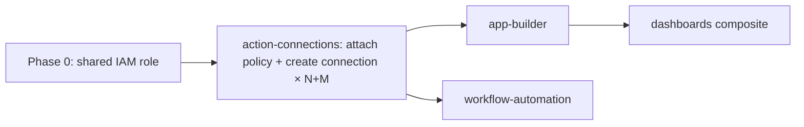

# Action Connections Skill

## Overview

Datadog Action Connections authorize Workflow Automation and App Builder to perform actions in external systems — AWS, HTTP APIs, and other integrations. Each connection encapsulates credentials so workflows and apps can execute actions without embedding secrets.

All connections for a project share a **single IAM role** created in Phase 0. Each connection gets its own **inline policy** on that role, scoped to exactly the AWS actions it needs. The role is created by the orchestrator — this skill only attaches policies and creates connections.

### Dependency Diagram



---

## Doc Fetch URLs

Before executing, fetch current API documentation:

| Source | URL / Resource |
|---|---|
| Datadog API docs | `https://docs.datadoghq.com/api/latest/action-connection.md` |
| Terraform provider | TF MCP → `datadog_action_connection` |

---

## When to Use

- You need to create a new action connection for Workflow Automation or App Builder
- You are debugging 403 errors on the `/api/v2/actions/connections` endpoint
- You need to set restriction policies on connections

---

## Prerequisites

> **Auth reminder:** Every Bash tool call must prefix with `source .env &&` to load credentials, since shell state does not persist between calls. If running standalone (outside `onboard-repository`), verify credentials first — see `.env.example` for required variables.

| Requirement | Details |
|---|---|
| `DD_API_KEY` | Datadog API key with org-level write access |
| `DD_APP_KEY` | Datadog app key with scopes: `connections_read`, `connections_write`, `connections_resolve`, `workflows_read`, `workflows_write`, `workflows_run`, `apps_run`, `apps_write` |
| AWS CLI | Configured with permissions: `iam:GetRole`, `iam:PutRolePolicy`, `sts:GetCallerIdentity` |
| `SHARED_ROLE_NAME` | Name of the shared IAM role created by Phase 0 (e.g., `datadog-aws-integration-role-{project}-{repo_id}`) |
| `SHARED_ROLE_ARN` | Full ARN of the shared IAM role (from `run-metadata.json`) |

---

## Supported Integration Types

| Type | `integration.type` | `credentials.type` | Use Case |
|---|---|---|---|
| **AWS** | `"AWS"` | `"AWSAssumeRole"` | Cross-account IAM role assumption |
| **HTTP Token** | `"HTTP"` | `"TokenAuth"` | APIs using bearer tokens or API keys |
| **HTTP Basic** | `"HTTP"` | `"HTTPBasic"` | APIs using HTTP Basic Auth |
| **HTTP OAuth** | `"HTTP"` | `"HTTPOAuth"` | APIs requiring OAuth2 token exchange |
| **HTTP mTLS** | `"HTTP"` | `"HTTPmTLS"` | APIs requiring mutual TLS client certificates |

---

## Output Mode

Read `preferred_output_format` from `{RUN_DIR}/repo-analysis.json` (when orchestrated) or `{repo_path}/repo-analysis.json` (standalone):

| `preferred_output_format` | Execution path | Output location |
|---|---|---|
| `terraform` | Query Terraform MCP for resource schemas, generate `.tf` files | `{RUN_DIR}/terraform/conn_app_{label}.tf` or `conn_wf_{label}.tf` |
| `shell` | Execute `curl` + `aws cli` commands directly via Bash tool | `{RUN_DIR}/manifest.json` (append entry per resource) |

The two Core Workflow sections below correspond to each mode.

---

## Core Workflow — Terraform Mode: AWS Connection Setup

Use the **exact schemas below** — do NOT query TF MCP or infer structure.

1. **Generate `.tf` file** at `{RUN_DIR}/terraform-staging/{branch}/conn_{app|wf}_{short_label_snake}.tf` containing:

   **`aws_iam_role_policy` resource** — scoped inline policy on the shared role:
   ```hcl
   resource "aws_iam_role_policy" "conn_{app|wf}_{short_label_snake}_policy" {
     name   = "{project}-{short_label}-policy-{REPO_ID}"
     role   = aws_iam_role.datadog_shared_role.name
     policy = jsonencode({
       Version = "2012-10-17"
       Statement = [{
         Effect   = "Allow"
         Action   = [/* scoped to exact actions this app/workflow needs */]
         Resource = "*"
       }]
     })
   }
   ```

   **`datadog_action_connection` resource** — exact schema:
   ```hcl
   resource "datadog_action_connection" "conn_{app|wf}_{short_label_snake}" {
     name = "{project}-{short_label}-conn-{REPO_ID}"
     aws {
       assume_role {
         account_id = "{AWS_ACCOUNT_ID}"   # 12-digit, from Phase 0 sts call
         role       = local.shared_role_name  # string local — avoids circular resource dep
         # external_id is READ-ONLY (computed by Datadog — do NOT set it as input)
         # Provider v3 SingleNestedBlock: access as aws.assume_role.external_id (NO [0] index)
       }
     }
     # NO depends_on — adding depends_on on the policy creates a three-way cycle:
     # connection → policy → role → connection trust policy → connection
   }
   ```

   **`output` block:**
   ```hcl
   output "conn_{app|wf}_{short_label_snake}_id" {
     value = datadog_action_connection.conn_{app|wf}_{short_label_snake}.id
   }
   ```

2. **Do NOT generate `aws_iam_role`** — that lives in `shared_role.tf` (generated by Phase 0).

3. **Do NOT set `external_id` as input** — it is computed by Datadog (Read-Only). The orchestrator reads `aws.assume_role.external_id` references post-Phase-2 to finalize `shared_role.tf`. Provider v3 uses `SingleNestedBlock` — no `[0]` index on `aws` or `assume_role`.

4. **Write branch result file** at `{RUN_DIR}/terraform-staging/{branch}/branch-result.json`:
   ```json
   {
     "connection_resource_name": "conn_{app|wf}_{short_label_snake}",
     "external_id_ref": "datadog_action_connection.conn_{app|wf}_{short_label_snake}.aws.assume_role.external_id"
   }
   ```

> **Note:** The orchestrator populates `shared_role.tf` `locals { all_external_ids = [...] }` post-Phase-2 using the `external_id_ref` values from all branch result files.

---

## Core Workflow — Shell Mode: AWS Connection Setup (6 Steps)

All API calls require headers: `DD-API-KEY: ${DD_API_KEY}`, `DD-APPLICATION-KEY: ${DD_APP_KEY}`, `Content-Type: application/json`.

### Step 0 — Verify shared role exists

Confirm the shared IAM role exists using `aws iam get-role --role-name ${SHARED_ROLE_NAME}`. If this fails, stop — the orchestrator (Phase 0) must create the role first.

### Step 1 — Attach named inline policy

Apply a named inline policy with `aws iam put-role-policy --role-name ${SHARED_ROLE_NAME} --policy-name {policy_name}`. Include `{repo_id}` in the policy name to namespace it for this run (e.g., `app-ecs-mgmt-policy-{repo_id}`, `wf-ecs-rollback-policy-{repo_id}`). Scope the policy to exactly the AWS actions this app/workflow needs.

### Step 2 — Create the action connection

`POST /api/v2/actions/connections` with `integration.type: "AWS"`, `credentials.type: "AWSAssumeRole"`, the shared role name, and 12-digit account ID. Include `{repo_id}` in the connection `name` field (e.g., `{project}-ecs-tasks-conn-{repo_id}`) to namespace it for this run.

**Critical:** the account ID field must be snake_case `account_id`, NOT camelCase `accountId` — the API silently rejects camelCase.

```json
{
  "data": {
    "type": "action_connection",
    "attributes": {
      "name": "{project}-{label}-conn-{repo_id}",
      "integration": {
        "type": "AWS",
        "credentials": {
          "type": "AWSAssumeRole",
          "role": "{SHARED_ROLE_NAME}",
          "account_id": "{12-digit-account-id}"
        }
      }
    }
  }
}
```

Response: `data.id` (connection UUID). **The external ID is also present in this POST response** — read it from the response body directly (see Step 3).

### Step 3 — Retrieve the external ID

**Always retrieve via GET after creation** — the POST response body does not reliably include the external ID (it may be empty or absent depending on whether the connection was freshly created or already existed).

```bash
GET_RESPONSE=$(source .env && curl -s \
  -H "DD-API-KEY: ${DD_API_KEY}" \
  -H "DD-APPLICATION-KEY: ${DD_APP_KEY}" \
  "https://api.datadoghq.com/api/v2/actions/connections/${CONNECTION_ID}")

EXTERNAL_ID=$(echo "$GET_RESPONSE" | jq -r '.data.attributes.integration.credentials.external_id')
echo "External ID: ${EXTERNAL_ID}"
```

**Correct response path:** `data.attributes.integration.credentials.external_id`

If the GET returns a non-200 or the field is null/empty, stop and report the error — do not proceed to trust policy finalization without a valid external ID.

### Step 4 — Record external ID in branch output file

Write the `external_id` to the branch output file (`{RUN_DIR}/branch-app-{short_label_snake}.json` or `branch-wf-{short_label_snake}.json`). The orchestrator collects all external IDs post-Phase-2 to finalize the trust policy in a single `update-assume-role-policy` call.

### Step 5 — Set restriction policy

`POST /api/v2/restriction_policy/connection:{connection_id}` with an `editor` binding for your org.

Get org ID: `GET /api/v2/current_user` → `data.relationships.org.data.id`. Note: this endpoint may return 401 if the app key lacks user-read scope — in that case skip the restriction policy step, the connection is still functional.

### Step 6 — Verify readiness

Poll `GET /api/v2/actions/connections/{connection_id}` until 200 (up to 30 seconds with exponential backoff).

---

## Gotchas & Patterns

| Gotcha | Details |
|---|---|
| **IAM role must start with `datadog-aws-integration-role`** | SCP blocks role creation if this prefix is absent. Full pattern: `datadog-aws-integration-role-{project_slug}-{repo_id}`. Truncate project to 30 chars (`cut -c1-30`) to stay within the 64-char AWS role name limit. |
| **`account_id` is snake_case** | Connection creation payload requires `account_id` (snake_case), NOT `accountId` (camelCase) — API rejects camelCase silently |
| **External ID via GET** | Always retrieve external ID via `GET /api/v2/actions/connections/{id}` after creation. Response path: `data.attributes.integration.credentials.external_id`. The POST response does not reliably include it (may be empty if the connection already existed). |
| **Fixed AWS account ID** | Datadog's account: `464622532012` (US1/US3/US5/EU1). AP1: `417141415827`, AP2: `412381753143`, GovCloud: `065115117704` or `392588925713` |
| **PascalCase required** | `credentials.type` must be `"AWSAssumeRole"` (not lowercase). `integration.type` must be `"AWS"` (uppercase) |
| **Role name, not ARN** | `credentials.role` takes the role name only (e.g., `"datadog-aws-integration-role-app-myapp"`), not the full ARN |
| **Restriction policy ID format** | Must be `"connection:{connection_id}"` — the resource type prefix is required |
| **IAM propagation delay** | Wait 5-10 seconds after `update-assume-role-policy` before testing the connection |
| **409 = already exists** | Connection name already exists — list connections, retrieve existing ID, skip creation |
| **TF DAG ordering: connection must use `local`, not resource ref** | `datadog_action_connection.assume_role.role` must be `local.shared_role_name` (string), NOT `aws_iam_role.datadog_shared_role.name` (resource ref). Resource ref creates a cycle: connection → role → trust policy → external_id → connection. The `aws_iam_role_policy` resource MUST use the resource ref (`aws_iam_role.datadog_shared_role.name`) to create an implicit dep on the role (ensures role exists before policy). Never add `depends_on` to `datadog_action_connection` — it breaks the three-way cycle. |
| **Provider v3 `SingleNestedBlock` — no `[0]` index** | Provider v3 uses `SingleNestedBlock` for `aws` and `assume_role`. Access external_id as `aws.assume_role.external_id` — NOT `aws[0].assume_role[0].external_id`. Use the un-indexed form in `branch-result.json` `external_id_ref` values. |
| **External ID rotation** | Regenerating external ID causes all workflows/apps using that connection to fail during rotation window |
| **Permission levels** | `viewer` < `resolver` < `editor`. `resolver` can only execute existing steps, not create new ones using the connection |

---

## Cross-Skill Notes

- **This skill is the single connection authority.** App-builder and workflow-automation delegate all connection creation here.
- **Shared IAM role model:** Phase 0 creates a single `datadog-aws-integration-role-{project_slug}-{repo_id}` (SCP-required prefix; project truncated to 30 chars). This skill attaches named inline policies and creates connections on that role. The orchestrator finalizes the trust policy post-Phase-2 with all external IDs.
- **Terraform mode:** Downstream skills reference the connection via `datadog_action_connection.{resource_name}.id` output. The shared role is in `shared_role.tf`.
- **Shell mode:** Pass connection UUID in `connectionEnvs[].connections[].connectionId` (workflow-automation) or replace `__CONNECTION_ID__` in app JSON (app-builder). Record `external_id` in branch output file for trust policy finalization.
- Each connection still gets **scoped IAM permissions** via its own named inline policy — only the role is shared.

---

## JSON Examples

This skill has no JSON examples (procedural, not template-based).
