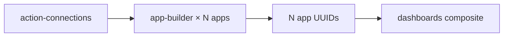

# App Builder Skill

## Overview

Datadog App Builder creates low-code AWS management consoles that run inside Datadog dashboards. Apps are built from two core primitives:

- **Queries** — calls to AWS actions (via an action connection) or Datadog APIs. Each query has an `actionId` (FQN), a `connectionId`, and `inputs`.
- **Components** — UI elements (tables, buttons, text inputs, dropdowns) on a grid. Components reference queries for data and trigger queries via `events`.

Apps are defined as JSON files, transformed before API submission, then published.

### Dependency Diagram



Each app gets its own dedicated action connection (1:1 — never shared).

---

## Doc Fetch URLs

Before executing, fetch current API and product documentation:

| Source | URL / Resource |
|---|---|
| Datadog API docs | `https://docs.datadoghq.com/api/latest/app-builder.md` |
| Components reference | `https://docs.datadoghq.com/actions/app_builder/components.md` |
| Queries reference | `https://docs.datadoghq.com/actions/app_builder/queries.md` |
| Events reference | `https://docs.datadoghq.com/actions/app_builder/events.md` |
| Expressions reference | `https://docs.datadoghq.com/actions/app_builder/expressions.md` |
| Terraform provider | TF MCP → `datadog_app_builder_app` |

---

## When to Use

- You want a UI inside Datadog to manage AWS resources without leaving the platform
- You need to bulk-create apps from JSON examples
- You are embedding apps inside a dashboard
- You need to wire an app to a new or rotated connection
- You need to build an app for an AWS service with no pre-built example definition

---

## Prerequisites

| Requirement | Details |
|---|---|
| Action connection | Created via action-connections skill; UUID provided as `connectionId` |
| App key scopes | `apps_run`, `apps_write`, `connections_read`, `connections_resolve` |
| Org ID | Required for restriction policies; fetch from `GET /api/v2/current_user` |

---

## Resource Scoping (Required for All Apps)

Every app must scope to project resources. Read from `{RUN_DIR}/repo-analysis.json` before building any app.

### Step 1 — Derive scope from repo-analysis.json

| Variable | Source field | Notes |
|---|---|---|
| `service_tag_values` | `services` array | Service names used as `service` tag values |
| `resource_types` | Derived from `cloud_provider_services` | Format: `{service}:{resourceType}`; see exceptions below |
| `resource_name_prefix` | Common leading string across IaC resource names | Fallback: project name |

**`resource_types` derivation — non-obvious exceptions:**

| `cloud_provider_services` entry | `resourceTypes` value |
|---|---|
| `step-functions` | `states:stateMachine` |
| `autoscaling` | `autoscaling:autoScalingGroup` |
| `ec2` | `ec2:instance` |
| `s3` | `s3:bucket` |
| `rds` | `rds:db` |
| `lambda` | `lambda:function` |
| `ecs` | `ecs:cluster` |
| `sqs` | `sqs:queue` |
| `dynamodb` | `dynamodb:table` |

When `services` is empty: skip tag injection — apps show all resources.

### Step 2 — Choose scoping approach

#### Option A — Tagged Resources discovery app (cross-service)

When `service_tag_values` is non-empty, build a **Tagged Resources discovery app** using `getResourcesByTags` (FQN: `com.datadoghq.aws.resourcetagging.getResourcesByTags`). Reference example: `Manage_Tagged_Resources.json`.

Key inputs:
- `filters`: `"${[{key: 'service', values: [tagValueInput.value || '__SERVICE_TAG_VALUE__']}]}"` — tag key always hardcoded to `'service'` (never parameterized)
- For multi-value: `"${[{key: 'service', values: __SERVICE_TAG_VALUES_JSON__}]}"`
- `resourceTypes`: populated from derived `resource_types` list (replace `["__RESOURCE_TYPES__"]` placeholder)

`getResourcesByTags` returns ARNs — for detail views, chain a service-specific describe query using the selected ARN.

#### Option B — Per-service scope injection (required for every app)

**Hard requirement — every app must implement scoping regardless of how it is built (example file or action catalog).**

| Service | Scoping method |
|---|---|
| EC2 (`describeInstances`) | Inject tag filter natively: `filters: [{name: "tag:service", values: [...service_tag_values]}]` |
| ECS, Lambda, S3, SQS, DynamoDB, RDS, and all others | Set `resource_name_prefix` as `defaultValue` on any name/search filter input; add DataTransform to filter results client-side using the prefix |

---

## Example App Definitions

Structural reference app definitions in `examples/app-definitions/`:

| File | AWS Service | Pattern Demonstrated |
|---|---|---|
| `Explore_S3_Files.json` | S3 | List-detail-action with modals; cleanest structural reference |
| `Manage_ECS_Tasks.json` | ECS | Multi-query wiring; table selection drives downstream queries |
| `Manage_Tagged_Resources.json` | Cross-service | `getResourcesByTags` discovery; tag-based scoping reference |

These are **structural references**, not templates to copy. For any AWS service, build from the action catalog using the pattern shown in these examples.

---

## Output Mode

Read `preferred_output_format` from `{RUN_DIR}/repo-analysis.json` (when orchestrated) or `{repo_path}/repo-analysis.json` (standalone):

| `preferred_output_format` | Execution path | Output location |
|---|---|---|
| `terraform` | Query Terraform MCP for resource schemas, generate `.tf` files | `{RUN_DIR}/terraform/app_{short_label_snake}.tf` |
| `shell` | Execute `jq` + `curl` commands directly via Bash tool | `{RUN_DIR}/manifest.json` (append entry per resource) |

The two Core Workflow sections below correspond to each mode.

---

## Core Workflow — Terraform Mode: Create App

Use the **exact schemas below** — do NOT query TF MCP or infer structure.

### Step 1 — Write app definition JSON file

Write the app definition as a separate JSON file at `{RUN_DIR}/terraform-staging/{branch}/app_{short_label_snake}_definition.json`:

1. Take the example JSON from `examples/app-definitions/{example}.json`
2. Remove server-managed fields: `handle`, `id` (top-level), `runAsUserUuid`, `deployment`
3. Leave `connectionId` fields with their existing `__CONNECTION_ID__` placeholder values — `action_query_names_to_connection_ids` overrides them at apply time

### Step 2 — Generate `app_{short_label_snake}.tf`

```hcl
resource "datadog_app_builder_app" "app_{short_label_snake}" {
  name      = "{project}-{short_label}-{REPO_ID}"
  published = true
  app_json  = file("${path.module}/app_{short_label_snake}_definition.json")

  # Maps every action query name in the JSON to the connection resource ID.
  # This OVERRIDES connectionId values in the JSON — no TF references needed inside the file.
  action_query_names_to_connection_ids = {
    "{query_name_1}" = datadog_action_connection.conn_app_{short_label_snake}.id
    "{query_name_2}" = datadog_action_connection.conn_app_{short_label_snake}.id
    # ... one entry per action query defined in the app JSON
  }
}

output "app_{short_label_snake}_id" {
  value = datadog_app_builder_app.app_{short_label_snake}.id
}
```

**To find query names:** read the JSON file's `queries` array; each entry with `"type": "action"` has a `name` field — that name is the key in `action_query_names_to_connection_ids`.

> **Gotcha — never embed app JSON as inline HCL objects.** Always use `file()` (separate `.json` file) or `jsonencode()` only. If using `jsonencode()` inline, all JS `${...}` expressions inside the JSON must be escaped as `$${...}` to prevent Terraform from interpolating them.

> **Note:** The shell-mode workflow below documents the JSON transformation, restriction policy, and publish steps. The Terraform provider handles restriction and publishing automatically.

---

## Core Workflow — Shell Mode: Create, Restrict, Publish

All API calls require headers: `DD-API-KEY`, `DD-APPLICATION-KEY`, `Content-Type: application/json`.

### Step 1 — Transform the app JSON

Before POSTing, transform the raw example JSON:

1. **Set `connectionId`** inside each action query's `properties.spec` (alongside `fqn` and `inputs`) — replacing `__CONNECTION_ID__` with the real UUID
2. **Remove the `handle` field** if present — the API rejects definitions that include `handle`
3. **Set `connections` array** with the real UUID — replacing `__CONNECTION_ID__`
4. **Replace `__RESOURCE_NAME_PREFIX__`** — with the common resource name prefix for client-side filtering (from `repo-analysis.json`). Use `""` when empty.
5. **Wrap in API envelope**:

```json
{
  "data": {
    "type": "appDefinitions",
    "attributes": {
      "name": "App Name [{repo_id}]",
      "description": "App description",
      "rootInstanceName": "grid0",
      "components": [...],
      "queries": [...],
      "connections": [...],
      "scripts": []
    }
  }
}
```

Use `jq` to perform the transformation. Append `{repo_id}` to the `name` field to namespace this app for the run:
```bash
jq --arg conn_id "${CONNECTION_ID}" \
   --arg repo_id "${REPO_ID}" \
   --arg name_prefix "${RESOURCE_NAME_PREFIX}" \
   --argjson service_tag_values "${SERVICE_TAG_VALUES_JSON}" \
  '{data: {type: "appDefinitions", attributes: {
    name: (.name + " [" + $repo_id + "]"),
    description: .description,
    rootInstanceName: .rootInstanceName,
    components: (.components | walk(if type == "string" then gsub("__RESOURCE_NAME_PREFIX__"; $name_prefix) else . end)),
    queries: (.queries | map(
      if .type == "action" then
        .properties.spec.connectionId = $conn_id
      else . end
    )),
    connections: [{"id": $conn_id, "name": "INTEGRATION_AWS"}],
    scripts: []
  }}}' example.json
```

> `SERVICE_TAG_VALUES_JSON` is a JSON array string (e.g. `'["api","worker"]'`); `RESOURCE_NAME_PREFIX` is the common resource name prefix for client-side filtering.

### Step 2 — Create the app

`POST /api/v2/app-builder/apps` with the transformed payload. Returns `201` with `data.id` (app UUID).

### Step 3 — Set org restriction policy

`POST /api/v2/restriction_policy/app-builder-app:{app_id}` with `editor` binding for org principal. This endpoint may return 401 if the app key lacks `user_access_read` scope — skip the restriction policy step, the app is still functional.

### Step 4 — Publish the app

`POST /api/v2/app-builder/apps/{app_id}/deployment` with empty body. After this the app is visible and embeddable.

---

## Gotchas & Patterns

| Gotcha | Details |
|---|---|
| **Must remove `handle`** | API rejects app definitions containing a `handle` field — always strip it before submission |
| **`appDefinitions` type** | The envelope `data.type` must be exactly `"appDefinitions"` (camelCase, plural) |
| **FQN case-sensitivity** | Action FQNs in `actionId` must match exact case; wrong case gives generic 400 "invalid app definition" |
| **Component state access** | Use `ui.{componentName}.value` for component state, `queries.{queryName}.data` for query results — mixing causes silent failures |
| **Table selected row** | `selectedRow` (singular) returns object; `selectedRows` (plural) returns array — using wrong one causes runtime errors |
| **FileUpload** | Returns `ui.{name}.files` (array) not `ui.{name}.value` |
| **runOnPageLoad** | Default is `false`; set `true` only for read-only list queries, never for mutating queries |
| **Polling minimum** | Minimum polling interval is 5000ms (5 seconds); lower values rejected silently |
| **Modal placement** | Modals are opened via `openModal` reaction, not placed directly in grid children |
| **DataTransform re-execution** | Automatically triggers whenever ANY referenced `queries.*` or `ui.*` changes — can cause cascading updates |
| **Embedded app context** | `global.dashboard` is undefined when app runs standalone; always use optional chaining: `global?.dashboard?.templateVariables?.{varName}?.[0]` |
| **Expression globals** | `_` (Lodash), `moment` (Moment.js), `JSON`, `Math`, `Array`, `Object`, `console` are all available in expressions |
| **Scoping is always required** | Every app must scope by service tag or name prefix (Option B in Resource Scoping section), whether built from an example file or from the action catalog. When `services` is empty, skip injection — apps show all resources |
| **Dashboard service variable** | When embedded in a dashboard, read `global?.dashboard?.templateVariables?.service?.[0]` to override scope; always use optional chaining — `global?.dashboard` is `undefined` standalone |
| **`getResourcesByTags` returns ARNs** | The action returns resource ARNs only — chain a service-specific describe query using the selected ARN for detail views |
| **`resourceTypes` format exceptions** | `step-functions` → `states:stateMachine`; `autoscaling` → `autoscaling:autoScalingGroup` — format is `{service}:{resourceType}`; always verify before use |
| **Every query needs a UUID `id`** | Each object in the `queries` array MUST have an `id` field with a unique UUID (e.g. `"id": "2c636319-35aa-4010-941c-59bd82ecc48a"`). Missing `id` fields cause `400 missing required field: /data/attributes/queries/N/id`. Generate a UUID for each query when building app definitions from scratch. |

---

## Dashboard Embedding

When an app is used inside a dashboard widget, the dashboard JSON contains a placeholder like `__APP_ID_EC2_MANAGEMENT__`. After creating the app, substitute the real UUID using `jq` or string replacement before creating the dashboard.

Embedded apps sync with dashboard template variables via `global?.dashboard?.templateVariables` and with the time frame via `global?.dashboard?.timeframe`.

---

## Action Catalog Reference

When looking up available actions, FQNs, required inputs, or output schemas:

1. Read the master index at `.claude/skills/shared/action-catalog-index.md`
2. Read the per-service file at `.claude/skills/shared/actions-by-service/{service}.md`
3. Use the exact FQN in query `actionId` fields

## Building from Action Catalog

When repo-analyzer recommends an app with no example definition (or for any service), build from the action catalog using `explore-s3.json` as the structural reference.

### Step 1 — Select actions from catalog

Read the `purpose` field from the app candidate in `repo-analysis.json`, then read `.claude/skills/shared/actions-by-service/{service}.md`. Select 3-5 actions that fulfill the purpose:

| Role | What to pick | Example (RDS) |
|---|---|---|
| List | Primary list/describe action | `describeRdsDbInstances` |
| Detail | Describe single resource (filtered) | `describeRdsDbInstances` (filtered by ID) |
| Mutate | Most common operational action | `modifyDBInstance` |
| Mutate 2 | Second operational action (if useful) | `rebootDBInstance` |
| Cleanup | Delete/stop (behind confirmation) | `deleteRdsDBInstance` |

### Step 2 — Build queries

For each action, create a query entry:
- List queries: `runOnPageLoad: true`, `onlyTriggerManually: false`
- Mutate queries: `onlyTriggerManually: true`, wire inputs from component state (`${table.selectedRow?.content?.fieldName}`)
- All action queries use `__CONNECTION_ID__` for `properties.spec.connectionId` (not at query top-level) and the exact FQN from the catalog as `actionId`

### Step 3 — Build components

Standard layout (see `explore-s3.json` for wiring pattern):
- Root grid → left table (list results) + right panel (detail + action buttons)
- Modal for destructive action confirmations
- Table `dataSource` → `${queries.ListQuery.data}`
- Button `onClick` → trigger mutate query or `openModal`

### Step 4 — Assemble and submit

Same transform + API flow as Core Workflow sections above (remove handle, wrap in appDefinitions envelope, POST, restrict, publish).

---

## Cross-Skill Notes

- **Delegates to action-connections**: Connection creation is handled by the action-connections skill. Provide a pre-existing `connection_id` or let orchestration create one.
- **Feeds into dashboards**: Each created app UUID must be collected for placeholder substitution in dashboard examples.
- **Terraform mode:** Dashboards skill references app IDs via `datadog_app_builder_app.app_{label}.id`. Connection wiring uses `file()` for example JSON + connection ID from action-connections output.
- **Shell mode:** App UUIDs collected in `{RUN_DIR}/onboarding-uuids.json` for Phase 3 dashboard creation.

---

## JSON Examples

Two structural reference app definitions in `examples/app-definitions/`. Each contains `queries`, `components`, and `connections` arrays with `__CONNECTION_ID__` placeholders. See "Example App Definitions" table above.
