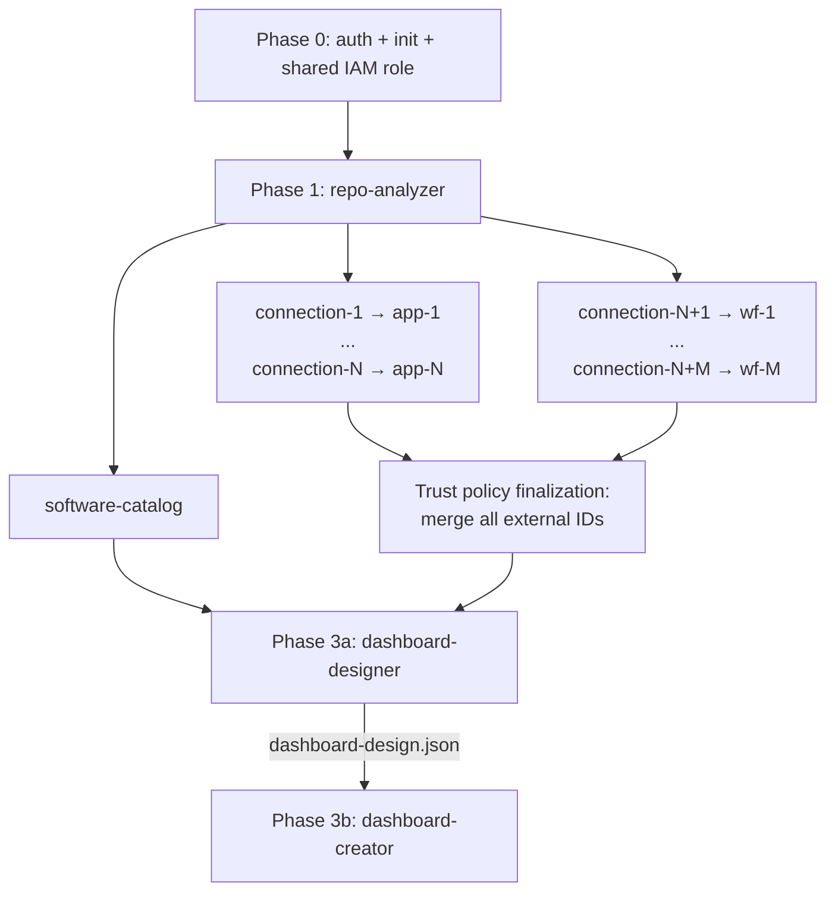

# Onboard Repository Dry Run Skill

## Overview

The dry-run skill produces a **conceptual report** of what Datadog resources would be created by the `onboard-repository` skill — no API calls are made, no files are generated, no resources are created. The report works identically for Terraform and non-Terraform repos because it reports on Datadog resources, not the customer's IaC format.

The report answers:
- What Datadog resources would be created (IAM roles, action connections, teams, apps, workflows, dashboards, catalog entities)
- What parameters would be needed (connection IDs, app IDs, team names, etc.)
- What dependencies exist between resources
- What order they'd be created in

See `../onboard-repository/SKILL.md` for the orchestration model this skill previews.

---

## When to Use

- You want to preview what onboarding would produce before committing
- You need to validate that repo-analyzer's recommendations make sense
- You want to estimate the scope of a full onboarding run

---

## Core Workflow

### Step 1 — Run repo-analyzer

Follow the `repo-analyzer` skill workflow to produce `repo-analysis.json`. This step is identical to a real onboarding run.

### Step 2 — Generate conceptual report

Produce a structured markdown report (output directly, do not write to file):

```
========================================
DRY RUN REPORT — {repo_path}
Generated: {date}
========================================

## Phase 1: Repo Analysis

AWS services: {list}
Infrastructure patterns: {list}
App candidates: {count} | Workflow candidates: {count}
Preferred output format: {terraform | shell}

Output files (would be written to `dd-onboarding-output/{project}-{timestamp}/`):
- `run-metadata.json`
- `repo-analysis.json`
- `datadog-recommendations.md`

## Phase 2: Resources to Create

### IAM Roles (1)

| # | Role Name | Trust Principal | Inline Policies |
|---|---|---|---|
| 1 | datadog-aws-integration-role-{project_slug}-{repo_id} | arn:aws:iam::464622532012:root | {N+M} (one per connection) |

### Inline Policies ({N+M})

| # | Policy Name | Attached To | Purpose | Key Permissions |
|---|---|---|---|---|
| 1 | app-{short_label}-policy | datadog-aws-integration-role-{project_slug}-{repo_id} | App: {short_label} Manager | {permission list} |
| ... | ... | ... | ... | ... |
| N+1 | wf-{short_label}-policy | datadog-aws-integration-role-{project_slug}-{repo_id} | Workflow: {short_label} Remediation | {permission list} |

### Action Connections ({N+M})

| # | Name | Type | Assumes Role | IAM Policy |
|---|---|---|---|---|
| 1 | Conn-App-{short_label} | AWS | datadog-aws-integration-role-{project_slug}-{repo_id} | app-{short_label}-policy |
| ... | ... | ... | ... | ... |
| N+1 | Conn-Wf-{short_label} | AWS | datadog-aws-integration-role-{project_slug}-{repo_id} | wf-{short_label}-policy |

### App Builder Apps ({N})

| # | Name | Services | Purpose | Connection |
|---|---|---|---|---|
| 1 | {short_label} Manager | {cloud_provider_services} | {purpose} | Conn-App-{short_label} |
| ... | ... | ... | ... |

### Workflow Automations ({M})

| # | Name | Blueprint | Purpose | Trigger | Connection |
|---|---|---|---|---|---|
| 1 | {short_label} Remediation | {blueprint or "from action catalog"} | {purpose} | {trigger} | Conn-Wf-{short_label} |
| ... | ... | ... | ... | ... |

### Datadog Teams ({count})

If `teams` array from `repo-analysis.json` is non-empty:

| # | Team Handle | Services Owned | Source |
|---|---|---|---|
| 1 | {teams[0].handle} | {teams[0].services} | IaC `Team` tags |
| ... | ... | ... | ... |

If `teams` is empty (fallback):

| # | Team Handle | Services Owned | Source |
|---|---|---|---|
| 1 | {project}-team | all services | Fallback (no Team tags in IaC) |

### Software Catalog Entities ({count})

| # | Entity | Kind | Owner |
|---|---|---|---|
| ... | ... | service | {team from teams→services mapping, or fallback} |

### Dashboard Design (Phase 3a)

| # | Step | Details |
|---|---|---|
| 1 | Widget selection | For each AWS service, select relevant widget groups from example dashboards |
| 2 | App placement | Place each app widget in its operationally relevant service group |
| 3 | Workflow placement | Place workflow trigger buttons after related app widgets |
| 4 | Omission rationale | Document why each skipped widget group was excluded |

**Design output:** `dashboard-design.json` specifying groups, selected widgets, omissions with rationale, and app/workflow placements.

### Dashboard Creation (Phase 3b)

| # | Name | Type | Dependencies |
|---|---|---|---|
| 1 | {project} Operations Dashboard | Composite | `dashboard-design.json` + all app UUIDs + workflow UUIDs |

## Phase 3: Dependency Graph



## Proposed Directory Structure

```
dd-onboarding-output/
└── {project}-{YYYYMMDD-HHMMSS}/
    ├── run-metadata.json              # Run config + phase tracking
    ├── repo-analysis.json             # Phase 1 machine-parseable output
    ├── datadog-recommendations.md     # Phase 1 human-readable report
    ├── onboarding-uuids.json          # Phase 2→3 handoff
    ├── dashboard-design.json          # Phase 3a → 3b handoff
    ├── terraform/                     # ← Terraform mode only
    │   ├── providers.tf
    │   ├── variables.tf
    │   ├── outputs.tf
    │   ├── shared_role.tf             # Shared IAM role + trust policy
    │   ├── conn_app_{short_label}.tf  # (×{connection_count} for apps)
    │   ├── conn_wf_{short_label}.tf   # (×{connection_count} for workflows)
    │   ├── app_{short_label}.tf       # (×{app_count})
    │   ├── wf_{short_label}.tf        # (×{workflow_count})
    │   ├── catalog.tf
    │   └── dashboard_composite.tf
    └── manifest.json                  # ← Shell mode only
```

## Output File Manifest

| Phase | File Path | Condition |
|---|---|---|
| 0 | `dd-onboarding-output/{run_id}/run-metadata.json` | Always |
| 0 | `dd-onboarding-output/{run_id}/terraform/providers.tf` | Terraform only |
| 0 | `dd-onboarding-output/{run_id}/terraform/variables.tf` | Terraform only |
| 0 | `dd-onboarding-output/{run_id}/terraform/outputs.tf` | Terraform only |
| 0 | `dd-onboarding-output/{run_id}/manifest.json` | Shell only |
| 1 | `dd-onboarding-output/{run_id}/repo-analysis.json` | Always |
| 1 | `dd-onboarding-output/{run_id}/datadog-recommendations.md` | Always |
| 2 | `dd-onboarding-output/{run_id}/terraform/conn_app_{short_label}.tf` | Terraform only (×{connection_count}) |
| 2 | `dd-onboarding-output/{run_id}/terraform/conn_wf_{short_label}.tf` | Terraform only (×{connection_count}) |
| 2 | `dd-onboarding-output/{run_id}/terraform/app_{short_label}.tf` | Terraform only (×{app_count}) |
| 2 | `dd-onboarding-output/{run_id}/terraform/wf_{short_label}.tf` | Terraform only (×{workflow_count}) |
| 2 | `dd-onboarding-output/{run_id}/terraform/catalog.tf` | Terraform only |
| 2→3 | `dd-onboarding-output/{run_id}/onboarding-uuids.json` | Always |
| 3a | `dd-onboarding-output/{run_id}/dashboard-design.json` | Always |
| 3b | `dd-onboarding-output/{run_id}/terraform/dashboard_composite.tf` | Terraform only |

Shell mode: `manifest.json` records every created resource with delete commands for cleanup.

## Summary

Total resources: {count}
- IAM roles: 1 (shared)
- Inline policies: {N+M}
- Action connections: {N+M}
- Datadog teams: {n}
- App Builder apps: {N}
- Workflows: {M}
- Catalog entities: {n}
- Dashboards: 1
Output files: {count} (see manifest above)

NO RESOURCES WERE CREATED. Run `onboard-repository` to execute.
========================================
```

---

## Resource Naming Convention

| Resource Type | Pattern |
|---|---|
| IAM Role (shared) | `datadog-aws-integration-role-{project}-{repo_id}` (SCP-required prefix; truncate project to 30 chars for 64-char AWS limit) |
| Inline Policy | `{type}-{short_label}-policy` (e.g., `app-ecs-mgmt-policy`) |
| Connection | `Conn-{Type}-{short_label}` |
| App | `{short_label} Manager` |
| Workflow | `{short_label} Remediation` |
| Dashboard | `{project_name} Operations Dashboard` |

Where `{type}` = `app` or `wf`.

---

## Cross-Skill Notes

- **Loads `onboard-repository`**: This skill previews the orchestration model from `onboard-repository`.
- **Identical Phase 1**: Repo analysis runs normally — only Phases 2-3 are conceptual.
- **No file output**: The report is displayed directly, not written to files.
- **Shared role model**: One IAM role per project with N+M inline policies. Teams come from `repo-analysis.json` `teams` array.
