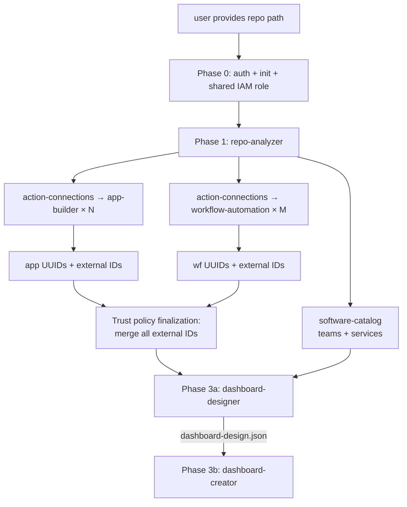
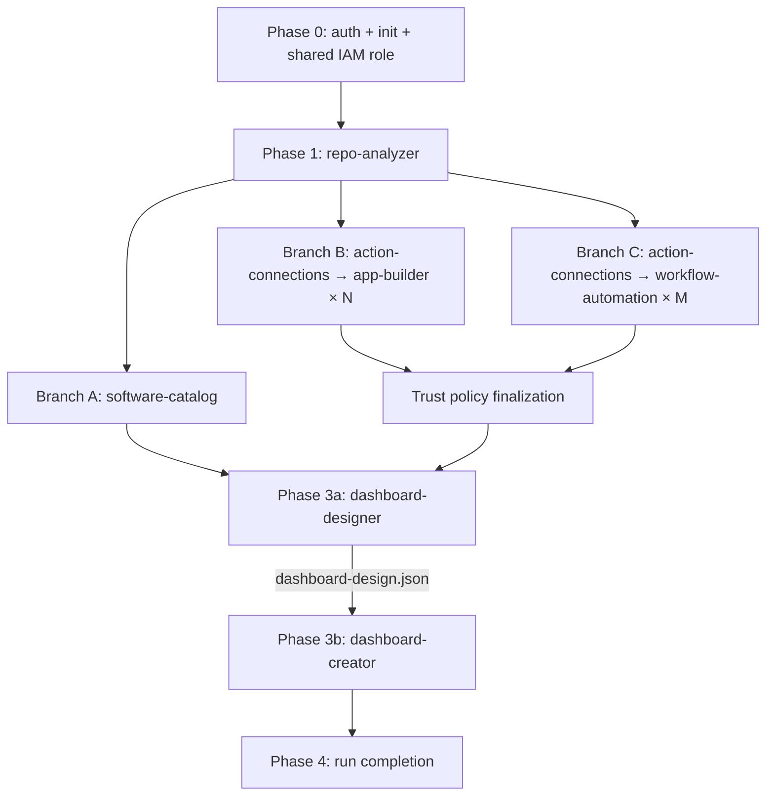

# Onboard Repository Skill

## Overview

The `onboard-repository` skill is the authoritative playbook for end-to-end Datadog onboarding. It coordinates all product skills in the correct dependency order — from repo analysis through composite dashboard creation.

## Orchestration Model



**Key rules:**
- Phase 0 creates a **shared IAM role** (`datadog-aws-integration-role-{project}-{repo_id}`) for all connections
- Each `app_candidate` and `workflow_candidate` gets its own action connection with a **named inline policy** on the shared role
- Phase 2 branches are independent and run in parallel
- Post-Phase-2: orchestrator finalizes trust policy with all external IDs
- Phase 3a (dashboard-designer) reasons about widget selection; Phase 3b (dashboard-creator) executes it

---

## Phase 0: Auth Validation + Run Initialization

Before any API calls, validate that credentials are present and working.

> **Shell env var expansion gotcha:** `source .env && terraform -var="key=${VAR}"` is unreliable — the `${VAR}` expansion is inconsistent when chained with `&&`. Instead, write a `terraform.tfvars` file via Python immediately after sourcing, then run `terraform` without `-var` flags:
> ```python
> source .env; python3 -c "
> import os; open('terraform.tfvars','w').write(
>   f'dd_api_key=\"{os.environ[\"DD_API_KEY\"]}\"\ndd_app_key=\"{os.environ[\"DD_APP_KEY\"]}\"\naws_profile=\"{os.environ[\"AWS_PROFILE\"]}\"\n'
> )
> "
> ```
> This file is auto-loaded by Terraform and is gitignored by default.

### Step 0a — Validate Credentials

1. **Source and validate environment variables:**
   ```bash
   source .env && echo "DD_API_KEY=${DD_API_KEY:?missing}" && echo "DD_APP_KEY=${DD_APP_KEY:?missing}" && echo "AWS_PROFILE=${AWS_PROFILE:?missing}"
   ```
   If any variable is unset, stop and tell the user to populate `.env` (see `.env.example`).

2. **Verify Datadog credentials:**
   ```bash
   source .env && curl -sf -o /dev/null -w '%{http_code}' -H "DD-API-KEY: ${DD_API_KEY}" https://api.datadoghq.com/api/v1/validate
   ```
   Expect `200`. A `403` means the API key is invalid or revoked.

3. **Verify AWS access:**
   ```bash
   source .env && aws sts get-caller-identity --profile "${AWS_PROFILE}"
   ```
   Expect a JSON response with `Account`, `Arn`, `UserId`. Any error means the profile is misconfigured or credentials are expired.

**All three checks must pass before proceeding.**

### Step 0b — Initialize Run Directory

1. **Generate REPO_ID:** A 4-character alphanumeric suffix that namespaces all Datadog and IAM resources for this run, preventing naming collisions across dev/test runs. Accept a user-supplied value or auto-generate, then **verify uniqueness** — the generated REPO_ID must not already be in use by an existing IAM role:
   ```bash
   while true; do
     REPO_ID="${REPO_ID:-$(LC_ALL=C tr -dc 'A-Z0-9' </dev/urandom | head -c 4)}"
     ROLE_CHECK=$(aws iam get-role --role-name "datadog-aws-integration-role-${PROJECT_SLUG}-${REPO_ID}" --profile "${AWS_PROFILE}" 2>&1) || true
     if echo "$ROLE_CHECK" | grep -q "NoSuchEntity"; then
       echo "REPO_ID: ${REPO_ID} (unique, no collision)"
       break
     else
       echo "REPO_ID ${REPO_ID} already in use — regenerating..."
       unset REPO_ID
     fi
   done
   ```
   Tell the user the REPO_ID immediately — they'll need it to identify or delete resources from this run.

2. **Generate run ID:** `{basename(repo_path)}-{YYYYMMDD-HHMMSS}-{repo_id}` (e.g., `stickerlandia-20260226-143052-A3F7`)

3. **Create run directory:**
   ```bash
   RUN_ID="{project}-$(date +%Y%m%d-%H%M%S)-${REPO_ID}"
   RUN_DIR="dd-onboarding-output/${RUN_ID}"
   mkdir -p "${RUN_DIR}"
   ```

4. **Write `run-metadata.json`:**
   ```json
   {
     "run_id": "{run_id}",
     "repo_id": "{repo_id}",
     "project": "{project}",
     "repo_path": "{repo_path}",
     "started_at": "{ISO 8601 timestamp}",
     "completed_at": null,
     "output_format": "pending",
     "status": "in_progress",
     "phases": {
       "1_analysis": "pending",
       "2_resources": "pending",
       "3a_dashboard_design": "pending",
      "3b_dashboard_create": "pending"
     }
   }
   ```
   `output_format` is set to `"pending"` here — it will be updated to `"terraform"` or `"shell"` in Step 1b after Phase 1 determines it.

5. **Store `RUN_DIR` path** — all downstream skills receive this as context.

### Step 0c — Create Shared IAM Role

Create a single shared IAM role for all Datadog action connections in this project.

**Shell mode:**
1. Create role with the SCP-required prefix, truncating project to 30 chars to stay within AWS's 64-char limit:
   ```bash
   # Role name must start with datadog-aws-integration-role (SCP requirement)
   # AWS IAM max 64 chars: fixed overhead is 34 (prefix 29 + hyphen + REPO_ID 4)
   PROJECT_SLUG=$(echo "${PROJECT}" | cut -c1-30)
   SHARED_ROLE_NAME="datadog-aws-integration-role-${PROJECT_SLUG}-${REPO_ID}"
   aws iam create-role --role-name "${SHARED_ROLE_NAME}" ...
   ```
   Trust policy allows `sts:AssumeRole` from Datadog's account (`464622532012`) with a placeholder external ID.
2. Record `SHARED_ROLE_NAME` and `SHARED_ROLE_ARN` in `run-metadata.json`:
   ```json
   "shared_role": {
     "name": "datadog-aws-integration-role-{project_slug}-{repo_id}",
     "arn": "arn:aws:iam::{account_id}:role/datadog-aws-integration-role-{project_slug}-{repo_id}"
   }
   ```

**Terraform mode:**
1. Generate `{RUN_DIR}/terraform/shared_role.tf` containing:

   ```hcl
   locals {
     shared_role_name = "datadog-aws-integration-role-{project_slug}-{REPO_ID}"
     all_external_ids = []
     # all_external_ids populated post-Phase-2 by orchestrator with connection external_id references
   }

   resource "aws_iam_role" "datadog_shared_role" {
     name = local.shared_role_name

     assume_role_policy = jsonencode({
       Version = "2012-10-17"
       Statement = [{
         Effect    = "Allow"
         Principal = { AWS = "arn:aws:iam::464622532012:root" }
         Action    = "sts:AssumeRole"
         Condition = {
           StringEquals = { "sts:ExternalId" = local.all_external_ids }
         }
       }]
     })
   }
   ```

> **Dependency design — why this works without a cycle:**
> The circular dependency `connections → role → connections` is avoided by separating the role name (a known constant) from the role resource (a Terraform-managed object). `local.shared_role_name` is a plain string local with no resource dependency. Connection resources reference `local.shared_role_name` — not `aws_iam_role.datadog_shared_role.name` — so they carry no dependency on the IAM role. The IAM role references `local.all_external_ids` → connection attributes, so it depends on connections. Terraform's dependency order becomes: **connections first (no deps) → IAM role (depends on connections) → policies (depend on role)**. The role is created with the correct trust policy on the very first apply.

All Phase 2 subagent prompts must include `local.shared_role_name` value and `AWS_ACCOUNT_ID`.

> **Reminder for all phases:** Every `curl`, `aws`, or other Bash command must start with `source .env &&` to load credentials into the shell session.

### Step 0d — Pre-fetch TF Schemas (terraform mode only)

This step is **required before Phase 2** in terraform mode. It ensures subagent prompts contain verified schema blocks instead of guessed ones.

1. **Load TF MCP tools** — call `ToolSearch` with query `"terraform datadog provider"` to load deferred TF MCP tools.
2. **Fetch schemas** for the three Datadog resources:
   - Use `get_provider_details` or `search_providers` to fetch schemas for `datadog_action_connection`, `datadog_app_builder_app`, `datadog_workflow_automation`
3. **Write `{RUN_DIR}/scratch/tf-schemas-summary.md`** containing the three verified HCL schema blocks:

   ```hcl
   # datadog_action_connection
   # DEPENDENCY DAG (critical to avoid cycles):
   #   1. datadog_action_connection  → no dependencies
   #   2. aws_iam_role               → depends on connections (via local.all_external_ids → external_ids)
   #   3. aws_iam_role_policy        → depends on role (via aws_iam_role.datadog_shared_role.name)
   #
   # RULES:
   # - connection.assume_role.role  uses local.shared_role_name  (string, NO resource dep → avoids cycle)
   # - aws_iam_role_policy.role     uses aws_iam_role.datadog_shared_role.name  (resource ref → correct ordering)
   # - connections must NOT have depends_on = [aws_iam_role_policy.*] — creates three-way cycle
   resource "datadog_action_connection" "conn_{app|wf}_..." {
     name = "{project}-{label}-conn-{REPO_ID}"
     aws {
       assume_role {
         account_id = "{AWS_ACCOUNT_ID}"        # 12-digit
         role       = local.shared_role_name    # ← string local, NOT resource attribute (avoids cycle)
         # external_id is READ-ONLY — do NOT set as input
       }
     }
     # NO depends_on here — adding depends_on = [aws_iam_role_policy.*] creates a three-way cycle
   }
   # external_id reference: datadog_action_connection.{name}.aws.assume_role.external_id
   # NOTE: provider v3 uses SingleNestedBlock — no [0] index. aws.assume_role.external_id, NOT aws[0].assume_role[0].external_id

   # aws_iam_role_policy — uses RESOURCE REFERENCE (not local) to create implicit dependency on role
   resource "aws_iam_role_policy" "conn_{app|wf}_{label}_policy" {
     name   = "{project}-{label}-policy-{REPO_ID}"
     role   = aws_iam_role.datadog_shared_role.name   # ← resource ref creates dep: policy → role → connections
     policy = jsonencode({ ... })
   }

   # datadog_app_builder_app
   resource "datadog_app_builder_app" "app_..." {
     name      = "{project}-{label}-{REPO_ID}"
     published = true
     app_json  = file("${path.module}/app_{label}_definition.json")
     action_query_names_to_connection_ids = {
       "{query_name}" = datadog_action_connection.conn_app_{label}.id
     }
   }

   # datadog_workflow_automation
   resource "datadog_workflow_automation" "wf_..." {
     name        = "{project}-{label}-{REPO_ID}"
     description = "..."
     published   = true
     tags        = ["project:{project}", "repo_id:{REPO_ID}"]
     spec_json   = jsonencode({
       "triggers"       : [{"dashboardTrigger": {}}],
       "steps"          : [...],
       "connectionEnvs" : [{"env": "default", "connections": [{"label": "INTEGRATION_AWS", "connectionId": "${datadog_action_connection.conn_wf_{label}.id}"}]}],
       "inputSchema"    : {
         "parameters" : [
           {"name": "paramName", "type": "STRING"}
           # GOTCHA: do NOT include "required": true — not supported by TF provider v3
         ]
       }
     })
   }
   ```

4. **Record `aws_account_id`** in `run-metadata.json` (from Phase 0a `sts get-caller-identity` output `Account` field).

---

## Phase 1: Repo Analysis

Follow the `repo-analyzer` skill workflow against the provided repo path, passing `RUN_DIR` so outputs are written to the run directory. **Wait for completion before starting Phase 2.**

The skill produces:
1. `{RUN_DIR}/datadog-recommendations.md` — human-readable report
2. `{RUN_DIR}/repo-analysis.json` — machine-parseable output

**Verify before continuing:**
- `app_candidates` array is non-empty
- `workflow_candidates` array is non-empty
- `preferred_output_format` is present (`terraform` | `shell`)

Update `run-metadata.json`: set `phases.1_analysis` to `"complete"` and `output_format` to the detected value.

### Step 1b — Mode-Specific Scaffolding

Now that `preferred_output_format` is known from `repo-analysis.json`, complete the deferred scaffolding:

**If terraform mode:**
1. Create `{RUN_DIR}/terraform/` and write these starter files:
   - `providers.tf`:
     ```hcl
     terraform {
       required_providers {
         datadog = { source = "DataDog/datadog", version = "~> 3.0" }
         aws     = { source = "hashicorp/aws", version = "~> 5.0" }
       }
     }

     provider "datadog" {
       api_key = var.dd_api_key
       app_key = var.dd_app_key
       api_url = "https://api.${var.dd_site}/"
     }

     provider "aws" {
       region  = var.aws_region
       profile = var.aws_profile
     }
     ```
   - `variables.tf`:
     ```hcl
     variable "dd_api_key" {
       type      = string
       sensitive = true
     }

     variable "dd_app_key" {
       type      = string
       sensitive = true
     }

     variable "dd_site" {
       type    = string
       default = "datadoghq.com"
     }

     variable "aws_region" {
       type    = string
       default = "us-east-1"
     }

     variable "aws_profile" {
       type    = string
       default = "default"
     }
     ```
   - `outputs.tf`: empty placeholder (filled by orchestrator as resources are created)
2. Run Step 0c (Create Shared IAM Role — terraform mode) to write `shared_role.tf`.
3. Run Step 0d (Pre-fetch TF Schemas) to populate `{RUN_DIR}/scratch/tf-schemas-summary.md`.

**If shell mode:**
1. Initialize empty `manifest.json`:
   ```json
   {
     "run_id": "{run_id}",
     "output_format": "shell",
     "resources": []
   }
   ```
2. Run Step 0c (Create Shared IAM Role — shell mode) to create the IAM role and record it in `run-metadata.json`.

---

## Phase 2: Parallel Fan-Out via Subagents

Launch subagents for each independent branch using the **Task tool**. All branches receive `RUN_DIR`, `output_format`, and `repo_path` as context. Each sub-skill has two Core Workflow sections — one for terraform mode, one for shell mode — and the subagent follows the matching workflow.

Update `run-metadata.json`: set `phases.2_resources` to `"in_progress"`.

### Rate Limiting (Shell Mode)

- **Shell mode:** Limit to **4 concurrent subagents** max. If more than 4 branches total, split into two waves (e.g., wave 1: catalog + first 3 app/wf branches, wave 2: remaining branches). Datadog API rate limits can cause 401/403 across the entire API key when too many concurrent requests hit simultaneously.
- **Terraform mode:** No rate limit concern — subagents only write `.tf` files. Keep full parallelism.

### Shell Mode — Parallel Execution

Launch ALL of the following as parallel Task tool calls in a **single message** (respecting the 4-concurrent-subagent limit above):

- **Subagent A (catalog):** "Use the Skill tool to invoke the `software-catalog` skill. Run it for {project}. Read `teams` array from `{RUN_DIR}/repo-analysis.json` for team→service ownership mapping. Create teams first (idempotent — 409 = already exists), then register bare service entities with correct ownership. Execute API calls via shell mode. Write results to `{RUN_DIR}/branch-catalog.json`."
- **Subagent B1..BN (one per `app_candidate`):** "Use the Skill tool to invoke the `action-connections` skill then the `app-builder` skill. Build an app for cloud provider services: {app_candidate.cloud_provider_services}. Purpose: {app_candidate.purpose}. Use shared role `{SHARED_ROLE_NAME}` (ARN: `{SHARED_ROLE_ARN}`). REPO_ID is `{REPO_ID}` — append it to all resource names (connection name, policy name, app name). Include `{short_label}` in the connection name. Execute API calls via shell mode. Write connection UUID, app UUID, and `external_id` to `{RUN_DIR}/branch-app-{short_label_snake}.json`."
- **Subagent C1..CM (one per `workflow_candidate`):** "Use the Skill tool to invoke the `action-connections` skill then the `workflow-automation` skill. Blueprint: {workflow_candidate.blueprint} (null means build from action catalog). Purpose: {workflow_candidate.purpose}. Use shared role `{SHARED_ROLE_NAME}` (ARN: `{SHARED_ROLE_ARN}`). REPO_ID is `{REPO_ID}` — append it to all resource names (connection name, policy name, workflow name). Include `{short_label}` in the connection name. Execute API calls via shell mode. Write connection UUID, workflow UUID, and `external_id` to `{RUN_DIR}/branch-wf-{short_label_snake}.json`."

Each subagent writes its own branch file (NOT `manifest.json` directly — concurrent file appends are unsafe).

After all subagents complete, the orchestrator:
1. Reads all `{RUN_DIR}/branch-*.json` files
2. Collects all `external_id` values from branch files
3. **Finalizes trust policy:** Single `aws iam update-assume-role-policy` call on the shared role with ALL collected external IDs as conditions
4. Waits 10 seconds for IAM propagation
5. Verifies all connections are healthy (`GET /api/v2/actions/connections/{id}` returns 200)
6. Merges entries into `{RUN_DIR}/manifest.json`
7. Assembles `{RUN_DIR}/onboarding-uuids.json`

### Terraform Mode — Staged Parallel Execution

Launch ALL of the following as parallel Task tool calls in a **single message**:

- **Subagent A (catalog):** "Use the Skill tool to invoke the `software-catalog` skill. Run it for {project}. Read `teams` array from `{RUN_DIR}/repo-analysis.json` for team→service ownership mapping. Generate `.tf` content. Write to `{RUN_DIR}/terraform-staging/catalog/catalog.tf`. **DO NOT run terraform init, validate, plan, or apply — only write the .tf file.**"
- **Subagent B1..BN (one per `app_candidate`):** "Use the Skill tool to invoke the `action-connections` skill then the `app-builder` skill. Build an app for cloud provider services: {app_candidate.cloud_provider_services}. Purpose: {app_candidate.purpose}. SHARED_ROLE_NAME (local string) is `{shared_role_name}` — use `local.shared_role_name` in connection resources, NOT `aws_iam_role.datadog_shared_role.name`. REPO_ID is `{REPO_ID}`. AWS_ACCOUNT_ID is `{aws_account_id}` (12-digit). Use ONLY the following pre-fetched schemas — do NOT guess or infer structure, do NOT query TF MCP: [paste full contents of `{RUN_DIR}/scratch/tf-schemas-summary.md`]. Write `.tf` files and app definition JSON file to `{RUN_DIR}/terraform-staging/app-{short_label_snake}/`. Write `{RUN_DIR}/terraform-staging/app-{short_label_snake}/branch-result.json` with `connection_resource_name` and `external_id_ref`."
- **Subagent C1..CM (one per `workflow_candidate`):** "Use the Skill tool to invoke the `action-connections` skill then the `workflow-automation` skill. Blueprint: {workflow_candidate.blueprint} (null means build from action catalog). Purpose: {workflow_candidate.purpose}. SHARED_ROLE_NAME (local string) is `{shared_role_name}` — use `local.shared_role_name` in connection resources, NOT `aws_iam_role.datadog_shared_role.name`. REPO_ID is `{REPO_ID}`. AWS_ACCOUNT_ID is `{aws_account_id}` (12-digit). Use ONLY the following pre-fetched schemas — do NOT guess or infer structure, do NOT query TF MCP: [paste full contents of `{RUN_DIR}/scratch/tf-schemas-summary.md`]. Write `.tf` files to `{RUN_DIR}/terraform-staging/wf-{short_label_snake}/`. Write `{RUN_DIR}/terraform-staging/wf-{short_label_snake}/branch-result.json` with `connection_resource_name` and `external_id_ref`."

Each subagent writes to an **isolated staging directory** (NOT `{RUN_DIR}/terraform/` directly — concurrent writes to the same directory are unsafe).

After all subagents complete, the orchestrator:
1. Reads all `{RUN_DIR}/terraform-staging/*/branch-result.json` files to collect `external_id_ref` values
2. **Finalizes `shared_role.tf`:** re-writes the `locals { all_external_ids = [...] }` block with real TF attribute references:
   ```hcl
   locals {
     all_external_ids = [
       datadog_action_connection.conn_app_{label}.aws.assume_role.external_id,
       datadog_action_connection.conn_wf_{label}.aws.assume_role.external_id,
       # ... one line per connection resource, from branch-result.json files
     ]
   }
   ```
3. Copies all `.tf` files and app definition JSON files from `{RUN_DIR}/terraform-staging/*/` into `{RUN_DIR}/terraform/`
4. Runs `unset OTEL_TRACES_EXPORTER && cd {RUN_DIR}/terraform && terraform validate`
5. Runs `unset OTEL_TRACES_EXPORTER && cd {RUN_DIR}/terraform && terraform plan` (tfvars auto-loaded)

### Branch Descriptions

#### Branch A: Software Catalog

1. Read `teams` array from `{RUN_DIR}/repo-analysis.json` for team→service ownership mapping
2. Create teams first (idempotent — 409 = already exists). If `teams` is empty, fall back to `{project}-team`
3. Register bare service entities with correct ownership per team→service mapping

**Output:** Team handles + catalog entity names

#### Branch B: App Builder (one per `app_candidate`)

For **each** `app_candidate` in `repo-analysis.json`:

1. Follow the `action-connections` skill workflow to create a scoped IAM role and connection for this app.
   - Include `short_label` in the connection name
   - Collect: connection UUID
2. Follow the `app-builder` skill workflow with the connection UUID.
   - Use `cloud_provider_services` and `purpose` from the app candidate to select actions and build the app
   - Collect: app UUID

**Output per branch:** One app UUID.

#### Branch C: Workflow Automation (one per `workflow_candidate`)

For **each** `workflow_candidate` in `repo-analysis.json`:

1. Follow the `action-connections` skill workflow to create a scoped connection for this workflow.
   - Include `short_label` in the connection name
   - Collect: connection UUID
2. Follow the `workflow-automation` skill workflow with the connection UUID.
   - Use `blueprint` (filename or null) and `purpose` from the candidate
   - Collect: workflow UUID

**Output per branch:** One workflow UUID.

### Per-Branch Status Tracking

Update `run-metadata.json`: set `phases.2_resources` to `"complete"`.

---

## Phase 2→3 Handoff Contract

After all Phase 2 subagents complete, the orchestrator merges branch output files and writes the collected UUIDs to `{RUN_DIR}/onboarding-uuids.json`:

```json
{
  "repo_id": "{repo_id}",
  "shared_role": {
    "name": "datadog-aws-integration-role-{project_slug}-{repo_id}",
    "arn": "arn:aws:iam::{account_id}:role/datadog-aws-integration-role-{project_slug}-{repo_id}"
  },
  "external_ids": {
    "app-EcsTasks": "ext-id-1",
    "wf-EcsRollback": "ext-id-2"
  },
  "branches": {
    "catalog": {"status": "complete"},
    "app-EcsTasks": {"status": "complete", "app_id": "uuid-from-app-builder", "external_id": "ext-id-1"},
    "app-S3": {"status": "failed", "error": "400 invalid definition"},
    "wf-EcsRollback": {"status": "complete", "workflow_id": "uuid-from-workflow-automation", "external_id": "ext-id-2"}
  },
  "app_ids": {
    "EcsTasks": "uuid-from-app-builder"
  },
  "workflow_ids": {
    "EcsRollback": "uuid-from-workflow-automation"
  }
}
```

The `branches` map tracks per-branch completion status (including failures). The `app_ids` and `workflow_ids` maps contain only successful results — keys are `short_label` values from `repo-analysis.json`, values are UUIDs returned by the create APIs (shell mode) or Terraform output reference names (terraform mode). Failed branches are omitted from the ID maps but recorded in `branches` for debugging.

---

## Phase 3a: Dashboard Design

**Wait for all app UUIDs and workflow UUIDs before starting.**

Update `run-metadata.json`: set `phases.3a_dashboard_design` to `"in_progress"`.

Follow the `dashboard-designer` skill workflow. Pass:
- `RUN_DIR` — run output directory
- `repo-analysis.json` — for service identification and priority ranking
- `onboarding-uuids.json` — for `app_ids` and `workflow_ids` maps
- Team handles from software-catalog output

The designer reads example dashboards from `dashboard-creator/examples/json/`, selects relevant widget groups for each service, places apps and workflows, and writes `{RUN_DIR}/dashboard-design.json`.

Update `run-metadata.json`: set `phases.3a_dashboard_design` to `"complete"`.

---

## Phase 3b: Dashboard Creation

Update `run-metadata.json`: set `phases.3b_dashboard_create` to `"in_progress"`.

Follow the `dashboard-creator` skill workflow, reading `{RUN_DIR}/dashboard-design.json` as input.

**Terraform mode:**
1. Dashboard-creator writes `{RUN_DIR}/terraform/dashboard_composite.tf` referencing app/workflow TF outputs
2. Orchestrator updates `{RUN_DIR}/terraform/outputs.tf` with all resource IDs
3. Orchestrator writes `{RUN_DIR}/terraform/terraform.tfvars` via Python (avoids `&&`-chain env var expansion issues):
   ```python
   source .env; python3 -c "
   import os; open('{RUN_DIR}/terraform/terraform.tfvars','w').write(
     'dd_api_key  = \"' + os.environ['DD_API_KEY'] + '\"\n' +
     'dd_app_key  = \"' + os.environ['DD_APP_KEY'] + '\"\n' +
     'aws_profile = \"' + os.environ['AWS_PROFILE'] + '\"\n'
   )
   "
   ```
4. Orchestrator runs the full apply (tfvars auto-loaded, no `-var` flags needed):
   ```bash
   unset OTEL_TRACES_EXPORTER && cd {RUN_DIR}/terraform && terraform init && terraform validate && terraform apply -auto-approve
   ```

**Shell mode:**
1. Dashboard-creator builds dashboard from design spec via API
2. Appends dashboard entry to `{RUN_DIR}/manifest.json`

The creator additively constructs widgets for each successfully created resource. Missing resources (failed branches) are simply omitted.

---

## Phase 4: Run Completion

After Phase 3 completes:

1. Update `{RUN_DIR}/run-metadata.json`:
   - Set `status` to `"complete"`
   - Set `completed_at` to current ISO 8601 timestamp
   - Set all phases to `"complete"`
2. Print summary to user:
   - Run ID and output directory path
   - **REPO_ID** — print prominently so the user can reference it for targeted cleanup
   - Resource count (apps, workflows, connections, catalog entities, dashboards)
   - Dashboard URL (if available)
   - For terraform mode: note that all `.tf` files are in `{RUN_DIR}/terraform/`
   - For shell mode: note that `manifest.json` contains delete commands for cleanup; all deletable resources have `{repo_id}` in their names for easy filtering

---

## Data Handoff Contracts

| Phase | Produces | Location | Consumed By |
|---|---|---|---|
| Phase 0 | `run-metadata.json` | `{RUN_DIR}/` | All phases (status tracking) |
| Phase 1 | `repo-analysis.json`, `datadog-recommendations.md` | `{RUN_DIR}/` | Phase 2 |
| Phase 2 | `.tf` files (terraform) or manifest entries (shell) | `{RUN_DIR}/terraform/` or `{RUN_DIR}/manifest.json` | Phase 3a |
| Phase 2 Branch A | Team handles, entity names | `{RUN_DIR}/terraform/catalog.tf` or manifest | Human reference |
| Phase 2 Branch B (×N) | App UUID per app | `{RUN_DIR}/onboarding-uuids.json` | Phase 3a |
| Phase 2 Branch C (×M) | Workflow UUID per workflow | `{RUN_DIR}/onboarding-uuids.json` | Phase 3a |
| Phase 3a | Dashboard design spec | `{RUN_DIR}/dashboard-design.json` | Phase 3b |
| Phase 3b | Composite dashboard URL | `{RUN_DIR}/terraform/dashboard_composite.tf` or manifest | Final output |
| Phase 4 | Updated `run-metadata.json` | `{RUN_DIR}/` | Future reference |

---

## Dependency Summary



### Terraform File Naming Convention

| Skill | Prefix | Example |
|---|---|---|
| shared IAM role (Phase 0) | `shared_role` | `shared_role.tf` |
| action-connections (app) | `conn_app_` | `conn_app_ecs_tasks.tf` |
| action-connections (wf) | `conn_wf_` | `conn_wf_ecs_rollback.tf` |
| app-builder | `app_` | `app_ecs_tasks.tf` |
| workflow-automation | `wf_` | `wf_ecs_rollback.tf` |
| software-catalog | `catalog` | `catalog.tf` |
| dashboard-creator | `dashboard_` | `dashboard_composite.tf` |

Convert `short_label` to snake_case for filenames (e.g., `EcsTasks` → `ecs_tasks`).

---

## Cross-Skill References

| Skill | Role in Onboarding | Key Output |
|---|---|---|
| `repo-analyzer` | Phase 1 — plan generation | `repo-analysis.json`, `preferred_output_format` |
| `software-catalog` | Phase 2 Branch A — registration | Team handles, entity names |
| `action-connections` | Phase 2 — prerequisite per app/workflow | Connection UUID |
| `app-builder` | Phase 2 Branch B — app deployment | App UUID |
| `workflow-automation` | Phase 2 Branch C — workflow creation | Workflow UUID |
| `dashboard-designer` | Phase 3a — widget selection and layout planning | `dashboard-design.json` |
| `dashboard-creator` | Phase 3b — composite dashboard creation | Dashboard URL |
