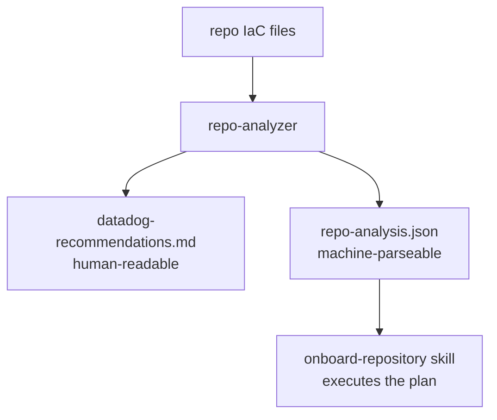

# Repo Analyzer Skill

## Overview

Scans a repository's IaC and infrastructure files to detect cloud provider services, identify microservices (application services - not cloud provider service types), and reccommend Datadog resources to create . Outputs a tiered `datadog-recommendations.md` report and a machine-parseable `repo-analysis.json`.

The focus is **infrastructure criticality** — what AWS services are most critical to monitor and manage for this project's operations. The output answers: "what Datadog resources should we build and in what order of importance?"



---

## When to Use

- Onboarding a new service onto Datadog and unsure where to start
- Deciding which App Builder apps are relevant to a repo's cloud infrastructure footprint
- Planning which Workflow Automation workflows to create based on detected infrastructure patterns

---

## Analysis Playbook

### Inventory the Repo

Scan for IaC file patterns to identify tooling and project structure:

- **Terraform:** `**/*.tf`, `**/*.tfvars`, `**/.terraform.lock.hcl`
- **CDK:** `**/cdk.json`, `**/lib/**/*.ts`
- **CloudFormation / SAM:** `**/cloudformation/**/*.yaml`, `**/template.yaml`

### Derive Output Format Preference

Based on detected IaC tooling:

| Detected IaC Tooling | `preferred_output_format` | Rationale |
|---|---|---|
| Terraform | `terraform` | Generate `.tf` files using Datadog Terraform provider |
| CloudFormation | `shell` | Execute `curl` + `aws cli` commands directly |
| CDK | `shell` | Execute `curl` + `aws cli` commands directly |
| Unknown / mixed | `shell` | Shell commands are the safe default |

**Edge case — mixed IaC:** 
- If `.tf` files are present → use `terraform` to generate `.tf` files using Datadog Terraform provider

### Identify Application Services and Microservices

Extract the **application services** (what the team owns and operates) from IaC resource tags and repo structure. These are NOT cloud provider service types — they are the application services that will be registered in Datadog Software Catalog. An intelligent process requireing thinking not just rule processing.

**Sources (in priority order):**

1. **`Service` tags on resources.** Deduplicate across resources — multiple resources with `Service: order-processor` = one service.
2. **IaC Module names.** For example when a repo has multiple CloudFormation templates named `{project}-{service}.yaml`, you may be able to infer the service name from the module name.
3. **Directory-per-service layout.** Top-level directories with their own IaC, `Dockerfile`, or `package.json` might be services.
4. **Fallback: project name.** If no `Service` tags and a single stack/template, use the project name as the sole service.

Populate the `microservices` array in `repo-analysis.json` with these values. The `software-catalog` skill reads this array directly to register catalog entities.

### Identify Teams

Extract **team ownership** from IaC resource tags, using the same scanning approach as application service extraction.

**Sources (in priority order):**

1. **`Team` tags on resources.** Deduplicate across resources — multiple resources with `Team: platform-engineering` = one team.
2. **Cross-reference `Team` + `Service` tags** on the same resources to build a team→service ownership map. For example, if a resource has `Team: platform-engineering` and `Service: data-storage`, that service belongs to that team.
3. **Fallback:** If NO `Team` tags are found anywhere in the repo, leave the `teams` array empty. Downstream skills will fall back to `{project}-team`.

Populate the `teams` array in `repo-analysis.json`. The `software-catalog` skill reads this array to create teams and assign service ownership.

### Identify Cloud Provider Services

Build a deduplicated list from IaC resource declarations. The following example uses AWS resources, but the process is the same for other cloud providers.

```
resource "aws_ecs_service"         -> ecs
resource "aws_instance"            -> ec2
resource "aws_security_group"      -> ec2 (flag for ingress pattern)
resource "aws_s3_bucket"           -> s3
resource "aws_dynamodb_table"      -> dynamodb
resource "aws_sqs_queue"           -> sqs
resource "aws_lambda_function"     -> lambda
resource "aws_sfn_state_machine"   -> step-functions
resource "aws_autoscaling_group"   -> autoscaling
resource "aws_db_instance"         -> rds
resource "aws_iam_role"            -> iam
```

For CDK: search `aws-cdk-lib/aws-<service>` imports. For CloudFormation: search `Type: AWS::<Service>::*`.

### Recommend App Builder Apps

**YOUR JOB IS NOT TO DESIGN THE COMPLETE APPS. YOUR JOB IS TO RECOMMEND FUNCTIONS THAT AN APP COULD PERFORM FOR THE DASHBOARD USER TO PROVIDE VALUE.**

Your job is to intelligently recommend App Builder apps that will be embedded in a composite dashboard used to manage the repo's infrastructure.

**Step A — Discover available actions for detected services.**
For each cloud provider service detected in the repo, check the action catalog index at `.claude/skills/shared/action-catalog-index.md` to confirm actions exist. If a per-service file exists at `.claude/skills/shared/actions-by-service/{service}.md`, read it to understand what operations (list, describe, update, delete, invoke, etc.) are available. The action catalog is the **sole authority** on what can be built — if actions exist for a service, an app can be built for it.

**Step B — Recommend apps based on available actions.**
Group related actions into coherent operator apps. Each app should combine related read + write operations for one or a few related services (e.g., a Kinesis app could combine describe_stream + list_streams + put_record + get_records). The `purpose` field should describe the operations available based on the actions, not based on whether an example app exists.

**Step C — Use example app definitions only as structural references.**
If an example exists in `.claude/skills/app-builder/examples/app-definitions/` for the same service, read it to understand component structure and layout patterns. If no example exists, that does **NOT** mean you can't recommend the app — the action catalog has the actions, and the downstream app-builder skill can construct the app from those actions.

### Recommend Workflow Automation Workflows

**YOUR JOB IS NOT TO DESIGN THE COMPLETE WORKFLOWS. YOUR JOB IS TO RECOMMEND FUNCTIONS THAT A WORKFLOW COULD PERFORM FOR THE DASHBOARD USER TO PROVIDE VALUE.**

**Step A — Discover available actions for detected services.**
Same as apps — check the action catalog index at `.claude/skills/shared/action-catalog-index.md` and per-service files at `.claude/skills/shared/actions-by-service/{service}.md` to understand what operations are available.

**Step B — Recommend workflows based on available actions and infrastructure patterns.**
Consider what operational/security remediation workflows would be highest value for the detected infrastructure. Workflows can be built from any actions in the catalog, not just services that have blueprints. Common patterns: remediate security findings, respond to monitor alerts, automate operational tasks. **CRITICAL CONSTRAINT**: While workflows can have multiple types of triggers, our complete workflows will only have dashboard trigger type or must have a dashboard trigger type in addition to another trigger type.

**Step C — Use blueprints only as structural references.**
If a relevant blueprint exists in `.claude/skills/workflow-automation/blueprints/`, reference it in the `blueprint` field. If no blueprint exists, set `blueprint` to `null` and the downstream workflow-automation skill will construct the workflow from action catalog actions.

### Decide highest value items to recommend

Recommendations should be bounded by the action catalog, not by which example apps or blueprints happen to exist. If the action catalog has actions for a detected service, that service is eligible for app and workflow recommendations.

Based on the most critical infrastructure in the project architecture, recommend the highest value and most feasible App Builder apps and Workflow Automation workflows to build for the operator's dashboard. Aim for a maximum of 6 total assets to add to the dashboard.

---

## Output Report Template

Write to `{RUN_DIR}/datadog-recommendations.md`:

```markdown
# Datadog Resources Recommendations
> Repo: {path} | Generated: {date} | Skill: repo-analyzer

## Findings Summary

- **Cloud provider services detected:** {comma-separated list}
- **Microservices / service directories:** {list}
- **IaC tooling:** {Terraform / CDK / CloudFormation / SAM}
- **Preferred output format:** {terraform | shell}
- **Teams detected:** {list or "none — fallback to {project}-team"}
- **App Builder apps to build:** {list}
- **Workflow Automation workflows to build:** {list}
---

## Structured Output (JSON)

Produce `repo-analysis.json`.

**This is the exact output schema. Use these field names exactly as written — no renaming, no additional fields, no omitted fields. Every field shown below is required.**

```json
{
  "repo_path": "<analyzed path>",
  "iac_tooling": "<Terraform | CloudFormation | CDK TypeScript>",
  "preferred_output_format": "<terraform | shell>",
  "cloud_provider_services": ["ecs", "sqs", "iam", "s3"],
  "microservices": ["<application services from Step 2 — NOT cloud provider service types>"],
  "teams": [
    {"handle": "<team-handle>", "services": ["<service-1>", "<service-2>"]}
  ],
  "app_candidates": [
    {
      "cloud_provider_services": "<cloud provider service(s)>",
      "short_label": "<PascalCase>",
      "purpose": "<what the app lets operators do, e.g. 'List, reboot, and modify RDS instances; toggle public accessibility'>"
    }
  ],
  "workflow_candidates": [
    {
      "blueprint": "<blueprint filename if one exists in blueprints/ folder, otherwise null>",
      "service": "<primary AWS service this workflow covers>",
      "trigger": "<security_signal | monitor_alert | scheduled | manual>",
      "tier": 2,
      "short_label": "<PascalCase>",
      "purpose": "<what the workflow achieves for this repo's infrastructure>"
    }
  ]
}
```

The `teams` array is always required. If no `Team` tags are found in IaC, set to `[]`.

### `purpose` Field

Always required. Describes the functional outcome from an operator's perspective.

- **For apps:** What operations the UI enables. Example: "Explore and manage S3 buckets: list, browse objects, download, delete"
- **For workflows:** What the workflow achieves for this repo's detected infrastructure. Example: "Roll back ECS service deployments when task failures spike"
- Do NOT include action FQNs, JSON structure, or implementation details — the downstream skill owns design and construction

---

## Where to Write

`RUN_DIR` is always provided by the `onboard-repository` orchestrator. All outputs go to the run directory:

| File | Location |
|---|---|
| `datadog-recommendations.md` | `{RUN_DIR}/` |
| `repo-analysis.json` | `{RUN_DIR}/` |

---