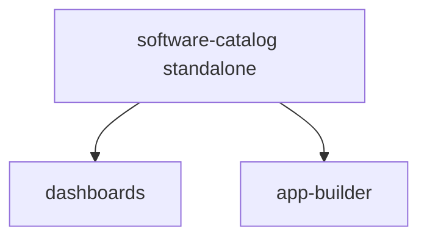

# Software Catalog Skill

## Overview

The Datadog Software Catalog gives every service a single source of truth: owner team, contacts, repo links, lifecycle state, dependency graph, and code location.

Key facts:
- Endpoint: `POST /api/v2/catalog/entity` — behaves as **upsert** (200, 201, 202 all mean success)
- Schema: **apiVersion: v3** with kinds: `service`, `datastore`, `queue`, `system`, `api`, `frontend`, `library`, `custom`
- Teams referenced in `metadata.owner` must exist before entity registration

### Dependency Diagram



No prerequisites from other skills.

---

## Doc Fetch URLs

Before executing, fetch current API and product documentation:

| Source | URL / Resource |
|---|---|
| Datadog API docs | `https://docs.datadoghq.com/api/latest/software-catalog.md` |
| Entity model | `https://docs.datadoghq.com/software_catalog/entity_model.md` |
| Setup guide | `https://docs.datadoghq.com/software_catalog/set_up.md` |
| Terraform provider | TF MCP → `datadog_software_catalog` |
| Official schemas | `https://github.com/DataDog/schema/tree/main/software-catalog` |

---

## When to Use

- Bootstrapping a new Datadog org with service catalog entries
- Programmatically registering services in CI/Lambda/GameDay setup
- Mapping service dependencies (`dependsOn`, `componentOf`)
- Registering non-service entities: databases, queues, systems, APIs, frontends, libraries
- Creating Datadog teams before entity registration

---

## Prerequisites

| Requirement | Details |
|---|---|
| `DD_API_KEY` | Datadog API key with org-level write access |
| `DD_APP_KEY` | Datadog app key — no special scopes required for catalog writes |
| Teams | Must exist in Datadog before entities reference them as `owner` |

---

## Output Mode

Read `preferred_output_format` from `{RUN_DIR}/repo-analysis.json` (when orchestrated) or `{repo_path}/repo-analysis.json` (standalone):

| `preferred_output_format` | Execution path | Output location |
|---|---|---|
| `terraform` | Query Terraform MCP for resource schemas, generate `.tf` files (v2.2 schema, kebab-case) | `{RUN_DIR}/terraform/catalog.tf` |
| `shell` | Execute `curl` commands directly via Bash tool (v3 API, camelCase) | `{RUN_DIR}/manifest.json` (append entry per resource) |

The two Core Workflow sections below correspond to each mode.

---

## Core Workflow — Terraform Mode: Teams and Entities

> **CRITICAL — when invoked as a Phase 2 subagent:** Write ONLY to `{RUN_DIR}/terraform-staging/catalog/catalog.tf`. Do NOT run `terraform init`, `terraform validate`, `terraform plan`, or `terraform apply`. The orchestrator owns the single consolidated apply after all Phase 2 subagents complete.

### Phase 0 — Pre-flight existence checks

Before generating any `.tf` output, check each team and entity against the live Datadog API. Only emit resources for items that do **not** already exist.

**Check teams:**
```bash
curl -s \
  -H "DD-API-KEY: ${DD_API_KEY}" \
  -H "DD-APPLICATION-KEY: ${DD_APP_KEY}" \
  "https://api.datadoghq.com/api/v2/teams?filter[keyword]={handle}" \
| jq --arg h "{handle}" '[.data[] | select(.attributes.handle == $h)] | length'
```
If result > 0 → skip this team. Log: `# SKIPPED: team {handle} already exists in Datadog`.

**Check entities:**
```bash
curl -s \
  -H "DD-API-KEY: ${DD_API_KEY}" \
  -H "DD-APPLICATION-KEY: ${DD_APP_KEY}" \
  "https://api.datadoghq.com/api/v2/catalog/entity?filter[ref]={kind}:{name}" \
| jq '.data | length'
```
If result > 0 → skip this entity. Log: `# SKIPPED: {kind}:{name} already exists in Datadog`.

Proceed to Steps 1–3 using only the **non-existing** teams and entities. If **all** items already exist, write a comment-only `catalog.tf` noting everything is registered and skip resource generation.

### Phase 1–3 — Generate Terraform

1. **Query TF MCP** for resource schemas: `datadog_team`, `datadog_software_catalog`
2. **Generate `.tf` file** at `{RUN_DIR}/terraform-staging/catalog/catalog.tf`. Begin with a pre-flight summary comment block:
   ```hcl
   # === SOFTWARE CATALOG: Pre-flight check results ===
   # EXISTING (skipped): team:backend-team, service:my-api
   # NEW (to be created): team:new-team, service:new-service
   ```
   Then emit `datadog_team` and `datadog_software_catalog` resources for non-existing items only.
3. **Important schema difference:** Terraform uses v2.2 schema with kebab-case field names (e.g., `service-url`) — the MCP docs will reflect this. The shell-mode workflow below uses v3 API with camelCase (e.g., `serviceURL`). Both populate the same catalog.

---

## Core Workflow — Shell Mode: Teams First, Then Entities

All API calls require headers: `DD-API-KEY`, `DD-APPLICATION-KEY`, `Content-Type: application/json`.

### Step 1 — Create teams

Read `teams` from `{RUN_DIR}/repo-analysis.json` (when orchestrated) or `{repo_path}/repo-analysis.json` (standalone). If the `teams` array is non-empty, create each `teams[].handle` via `POST /api/v2/team`. If `teams` is empty or absent, fall back to creating a single `{project}-team`. This is idempotent: 409 = already exists = success.

### Step 2 — Register entities

Set `metadata.owner` per the team→service mapping from `teams[].services`. Services not listed in any team's `services` array get the first team (or the fallback `{project}-team`).

**Skip-if-exists check:** Before registering each entity, check whether a catalog entity with that `metadata.name` already exists:

```bash
source .env && curl -s \
  -H "DD-API-KEY: ${DD_API_KEY}" \
  -H "DD-APPLICATION-KEY: ${DD_APP_KEY}" \
  "https://api.datadoghq.com/api/v2/catalog/entity?filter[ref]=service:{name}" \
| jq '.data | length'
```

If the result is `> 0`, log `"Skipping {name} — already exists in catalog"` and move on. Only register entities that do not yet exist.

`POST /api/v2/catalog/entity` with v3 JSON body for each new entity. 200, 201, 202 all mean success.

v3 entity structure:
```json
{
  "apiVersion": "v3",
  "kind": "service",
  "metadata": {
    "name": "my-service",
    "owner": "backend-team",
    "description": "Service description",
    "contacts": [{"name": "Support", "type": "email", "contact": "team@example.com"}],
    "links": [{"name": "Repo", "type": "repo", "url": "https://github.com/org/repo"}],
    "tags": ["env:production"]
  },
  "spec": {
    "lifecycle": "production",
    "tier": "High",
    "dependsOn": ["datastore:postgres-main", "queue:email-queue"],
    "componentOf": ["system:platform"]
  },
  "integrations": {
    "pagerduty": {"serviceURL": "https://..."}
  },
  "datadog": {
    "codeLocations": [{"repositoryURL": "https://github.com/org/repo", "paths": ["services/my-service/**"]}]
  },
  "extensions": {"cost-center": "eng-1234"}
}
```

---

## Entity Kinds

| Kind | Description | Key Spec Fields |
|---|---|---|
| `service` | Backend service or microservice | `type`, `lifecycle`, `tier`, `languages`, `dependsOn`, `componentOf` |
| `system` | Container grouping entities | `components` list |
| `datastore` | Database or data store | `type` (postgres, redis, etc.), `dependencyOf` |
| `queue` | Message queue or event stream | `type` (kafka, sqs, etc.), `dependencyOf` |
| `api` | API definition | `type` (openapi, grpc), `interface`, `implementedBy` |
| `frontend` | Web or mobile application | `type` (web-app, mobile-app), `languages`, `dependsOn` |
| `library` | Shared library, SDK, package | `type` (library, sdk), `languages`, `dependencyOf` |
| `custom` | Any entity not covered above | Free-form `spec` fields |

---

## Gotchas & Patterns

| Gotcha | Details |
|---|---|
| **camelCase in v3** | v3 integrations use `serviceURL` (camelCase); v2.2 uses `service-url` (kebab-case) — mixing causes validation errors |
| **Team handle case-sensitivity** | Handles are case-sensitive; wrong case causes "owner team does not exist" error |
| **Entity names must be kebab-case** | Lowercase, hyphens only, no spaces or uppercase |
| **Entity ref format** | `kind:name` (e.g., `service:my-service`, `datastore:postgres-main`) |
| **Relationship resolution is async** | References to non-existent entities don't error immediately — show as "unresolved" in UI |
| **Bidirectional relationships** | Datadog infers reverse direction automatically — `dependsOn` creates implicit `dependencyOf` |
| **Delete uses UUID, not ref** | `DELETE /api/v2/catalog/entity/{entity_id}` uses UUID from response, NOT entity ref |
| **Code locations** | v3 uses `datadog.codeLocations[]` (first-class field); the `code_location:<glob>` tag is legacy v2.x |
| **additionalOwners** | Enables multi-ownership: `metadata.additionalOwners[].type` can be `team` or `operator` |
| **Discovered vs user-defined** | Upserting a full v3 entity with same name as APM-discovered service enriches and converts it |
| **Namespace** | Optional, defaults to `"default"` — enables multi-tenant catalog in same org |
| **Terraform pre-flight uses live API** | `DD_API_KEY` and `DD_APP_KEY` must be set in the shell before running the skill in terraform mode |

---

## Cross-Skill Notes

- **dashboards**: Filter monitor queries by `service:<name>`. The `metadata.name` is the entity ref.
- **workflow-automation**: Service names should match the `service` tag on metrics/traces for monitor-triggered workflows.
- **repo-analyzer**: Generates service list mapping to this skill's entity registration.

---

## JSON Examples

`examples/services.yaml` — sample service definitions (3 services with teams, dependencies, contacts) for reference when building entity payloads. Convert to v3 JSON for API submission.
