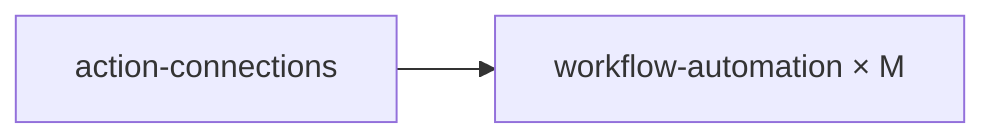

# Workflow Automation Skill

## Overview

Datadog Workflow Automation runs multi-step runbooks in response to security signals, monitor alerts, or manual triggers. Each workflow is a directed graph of `steps`, each calling an AWS action (or Datadog API) via an action connection.

### Dependency Diagram



Each workflow gets its own dedicated action connection (1:1 — never shared).

---

## Doc Fetch URLs

Before executing, fetch current API and product documentation:

| Source | URL / Resource |
|---|---|
| Datadog API docs | `https://docs.datadoghq.com/api/latest/workflow-automation.md` |
| Triggers reference | `https://docs.datadoghq.com/actions/workflows/triggers.md` |
| Build workflows | `https://docs.datadoghq.com/actions/workflows/build.md` |
| Actions reference | `https://docs.datadoghq.com/actions/workflows/actions.md` |
| Expressions | `https://docs.datadoghq.com/actions/workflows/expressions.md` |
| Terraform provider | TF MCP → `datadog_workflow_automation` |

---

## When to Use

- You need automated incident response for AWS resources triggered by Datadog findings
- You want to automate operational runbooks (ECS rollbacks, tag enforcement, scorecard updates)
- You need a monitor to trigger remediation automatically
- You want to chain multiple AWS API calls in a workflow

---

## Prerequisites

| Requirement | Details |
|---|---|
| Action connection | Created via action-connections skill; UUID goes in `connectionEnvs` |
| App key scopes | `workflows_read`, `workflows_write`, `workflows_run`, `connections_read`, `connections_resolve` |

---

## Output Mode

Read `preferred_output_format` from `{RUN_DIR}/repo-analysis.json` (when orchestrated) or `{repo_path}/repo-analysis.json` (standalone):

| `preferred_output_format` | Execution path | Output location |
|---|---|---|
| `terraform` | Query Terraform MCP for resource schemas, generate `.tf` files | `{RUN_DIR}/terraform/wf_{short_label_snake}.tf` |
| `shell` | Execute `curl` commands directly via Bash tool | `{RUN_DIR}/manifest.json` (append entry per resource) |

The two Core Workflow sections below correspond to each mode.

---

## Core Workflow — Terraform Mode: Create Workflow

Use the **exact schema below** — do NOT query TF MCP or infer structure.

**Required fields:** `name`, `description`, `published = true`, `tags`, `spec_json`

**Generate `.tf` file** at `{RUN_DIR}/terraform-staging/{branch}/wf_{short_label_snake}.tf`:

```hcl
resource "datadog_workflow_automation" "wf_{short_label_snake}" {
  name        = "{project}-{short_label}-{REPO_ID}"
  description = "{purpose from workflow_candidate}"
  published   = true
  tags        = ["project:{project}", "repo_id:{REPO_ID}"]
  spec_json   = jsonencode({
    "triggers" : [{ "dashboardTrigger" : {} }],
    "steps" : [
      {
        "name"           : "{StepName}",
        "actionId"       : "{com.datadoghq.aws.service.action_name}",
        "connectionLabel": "INTEGRATION_AWS",
        "parameters"     : [
          { "name" : "{param_name}", "value" : "{param_value}" }
        ]
      }
    ],
    "connectionEnvs" : [{
      "env" : "default",
      "connections" : [{
        "label"        : "INTEGRATION_AWS",
        "connectionId" : "${datadog_action_connection.conn_wf_{short_label_snake}.id}"
      }]
    }],
    "inputSchema" : {
      "parameters" : []
    }
  })
}

output "wf_{short_label_snake}_id" {
  value = datadog_workflow_automation.wf_{short_label_snake}.id
}
```

**Key rules:**
- `spec_json` uses `jsonencode({...})` — connection IDs are wired directly inside `connectionEnvs` using the TF resource reference inside the `jsonencode` block
- `connectionLabel` in each step must **exactly match** (case-sensitive) the `label` in `connectionEnvs[].connections[]`
- Always include `triggers: [{"dashboardTrigger": {}}]` — without it, dashboard `run_workflow` widgets and manual API calls won't work
- Load steps from `blueprints/{spec}.json` if a blueprint exists; otherwise build from action catalog
- If using a blueprint, inline its `steps`, `triggers`, `connectionEnvs` arrays directly inside `jsonencode({...})` replacing `__CONNECTION_ID__` with the TF resource reference

> **Note:** The shell-mode workflow below documents the same spec structure and API envelope. The JSON spec structure (steps, triggers, connectionEnvs, inputSchema) is the same regardless of mode — the terraform resource wraps it.

---

## Core Workflow — Shell Mode: Submit a Workflow Spec

All API calls require headers: `DD-API-KEY`, `DD-APPLICATION-KEY`, `Content-Type: application/json`.

### Workflow spec structure

```json
{
  "name": "Workflow Name",
  "spec": {
    "triggers": [...],
    "steps": [...],
    "connectionEnvs": [...],
    "inputSchema": {...}
  }
}
```

- **`steps`** — ordered actions; each has `name`, `actionId`, `connectionLabel`, `parameters` (array — see below), optional `outboundEdges`
- **`triggers`** — what starts the workflow; always use `dashboardTrigger` (see Trigger Types below)
- **`connectionEnvs`** — maps a label to a real connection ID per environment
- **`inputSchema`** — parameters the caller supplies at runtime; parameter `type` must be uppercase (`"STRING"`, `"INTEGER"`, `"BOOLEAN"`) not lowercase

### Step 1 — Prepare the spec

**If an example spec exists** in `blueprints/` for this workflow type, load it and replace `__CONNECTION_ID__` with the real UUID.

**If no example spec exists**, build from the action catalog using the candidate's `purpose` field — see "Building from Action Catalog" below.

The `triggers` array must contain exactly `[{"dashboardTrigger": {}}]`. Do not add other trigger types alongside it — the API rejects mixing `workflowTrigger` with any other trigger type, and `dashboardTrigger`-only workflows satisfy all dashboard embedding and manual invocation requirements.

**Step parameters format:** `parameters` on each step must be an **array** of `{name, value}` objects, NOT a flat object map:
```json
"parameters": [
  {"name": "region", "value": "us-east-1"},
  {"name": "bucket", "value": "{{ Trigger.bucket_name }}"}
]
```

**inputSchema parameter types** must be uppercase: `"STRING"`, `"INTEGER"`, `"BOOLEAN"` — lowercase is rejected by the API.

### Step 2 — Create the workflow

`POST /api/v2/workflows` with the spec wrapped in API envelope:

```json
{
  "data": {
    "type": "workflows",
    "attributes": {
      "name": "Workflow Name [{repo_id}]",
      "description": "...",
      "published": true,
      "spec": { ...spec from example... }
    }
  }
}
```

Note: `data.type` must be `"workflows"` (plural).

### Step 3 — Verify

Check response for `data.id` (workflow UUID). Save for dashboard embedding.

---

## Variable Interpolation

| Context | Syntax | Example |
|---|---|---|
| Step output | `{{ Steps.StepName.fieldName }}` | `{{ Steps.Describe_task_definition.taskDefinition.cpu }}` |
| Security trigger | `{{ Source.securityFinding.resource }}` | IAM username from SIEM alert |
| Monitor trigger | `{{ Source.monitor.* }}` | Monitor alert data |
| Manual/API trigger | `{{ Trigger.param_name }}` | `{{ Trigger.service_name }}` |
| Loop value | `{{ Current.Value }}` | Inside a `forLoop` step |

---

## Trigger Types

**Always use `dashboardTrigger` only.** It supports manual execution, API calls, and dashboard Run Workflow widgets — covering all onboarding use cases.

```json
"triggers": [{"dashboardTrigger": {}}]
```

Do NOT mix `workflowTrigger` with any other trigger type — the API rejects this combination. Other trigger types (`securityTrigger`, `monitorTrigger`) can be used standalone for non-onboarding workflows but are not used in the standard onboarding pipeline.

## Building from Action Catalog

When repo-analyzer recommends a workflow with no matching example, build from the action catalog. Use `AWS-IAM-Disable-User.json` as structural reference for single-step, `ECS-Rollback-Leaderboard.json` for multi-step.

### Step 1 — Select actions from catalog

Read the `purpose` and `trigger` from the workflow candidate in `repo-analysis.json`, then read `.claude/skills/shared/actions-by-service/{service}.md`. Select the remediation action(s) — usually 1-2 for simple workflows, 3-4 for multi-step chains.

### Step 2 — Map inputs to trigger context

| Trigger type | Input source | Example |
|---|---|---|
| Security signal | `{{ Source.securityFinding.resource }}` | IAM username from SIEM |
| Monitor alert | `{{ Source.monitor.* }}` or `inputSchema` | Service name from alert |
| Manual/dashboard | `inputSchema` parameters | Operator-supplied values |

### Step 3 — Compose the spec

1. Define steps with action FQNs from catalog, wire `connectionLabel: "INTEGRATION_AWS"`; set `parameters` as an array of `{name, value}` objects
2. Chain steps via `outboundEdges: [{"branchName": "main", "nextStepName": "..."}]`
3. Set `triggers: [{"dashboardTrigger": {}}]`
4. Define `connectionEnvs` with `__CONNECTION_ID__`
5. Add `inputSchema` for any operator-supplied parameters; use uppercase types (`"STRING"`, `"INTEGER"`, `"BOOLEAN"`)

### Step 4 — Submit

Same API flow as Core Workflow sections above.

---

## Top 10 Action IDs

| Action ID | Service | Operation |
|---|---|---|
| `com.datadoghq.aws.iam.disable_user` | IAM | Disable IAM user login |
| `com.datadoghq.aws.ec2.revoke_security_group_ingress` | EC2 | Remove SG ingress rules |
| `com.datadoghq.aws.ec2.modify_instance_metadata_options` | EC2 | Enforce IMDSv2 |
| `com.datadoghq.aws.ecs.describeTaskDefinition` | ECS | Get task definition details |
| `com.datadoghq.aws.ecs.registerTaskDefinition` | ECS | Register new revision |
| `com.datadoghq.aws.ecs.updateEcsService` | ECS | Update service |
| `com.datadoghq.datatransformation.func` | Transform | Run JavaScript function |
| `com.datadoghq.core.forLoop` | Core | Iterate over a list |
| `com.datadoghq.core.if` | Core | Conditional branch |
| `com.datadoghq.dd.cases.createCase` | Datadog | Create a case/incident |

---

## Gotchas & Patterns

| Gotcha | Details |
|---|---|
| **`connectionLabel` case-sensitivity** | Must **exactly match** (case-sensitive) the `label` in `connectionEnvs[].connections[].label` |
| **`data.type` is plural** | Must be `"workflows"` not `"workflow"` |
| **If branch names** | Must be exactly `"true"` and `"false"` (strings, lowercase), NOT boolean values |
| **Loop branch names** | Must be exactly `"loop"` and `"after_loop"` |
| **Error branch name** | Must be exactly `"error"` (lowercase) |
| **No list API by name** | Cannot query workflows by name or handle — must track ID externally |
| **409 = handle exists** | Workflow handle already exists; requires external ID lookup to update |
| **Monitor trigger syntax** | `@workflow-My-Workflow-Name` in monitor message body; params: `@workflow-Name(param="value")` |
| **Rate limits** | Without rate limiting on triggers, every alert fires the workflow — set `{ "count": 1, "interval": "3600s" }` |
| **JavaScript steps** | Must define `function main(args)` and return value; max 10 KB script size |
| **Python steps** | Must define `def main(ctx)` and return serializable value; Python 3.12.8 runtime |
| **Loop iteration limit** | 2,000 per loop; automatic silent exit if exceeded |
| **Max steps per workflow** | 150 |
| **Workflow execution timeout** | 7 days maximum |
| **Security trigger resources** | `resourceConfiguration.*` fields vary by AWS resource type — verify field availability |
| **Scheduled trigger** | Executes under service account context; no `inputSchema` parameters available |
| **`dashboardTrigger` only** | Always use `triggers: [{"dashboardTrigger": {}}]` — do NOT mix with `workflowTrigger` (API rejects the combination). `dashboardTrigger` alone satisfies all dashboard embedding and manual invocation requirements |
| **`parameters` is an array** | Step `parameters` must be `[{"name": "key", "value": "val"}, ...]` — NOT a flat `{"key": "val"}` object map |
| **inputSchema types are uppercase** | `"STRING"`, `"INTEGER"`, `"BOOLEAN"` — lowercase (`"string"`, `"integer"`) is rejected by the API |
| **`inputSchema.parameters` no `required` field** | The TF provider v3 Go client rejects `"required": true` (or any `required` field) in `inputSchema.parameters[]` with "object contains additional property". Only `name` and `type` are valid fields per parameter object. |

---

## Cross-Skill Notes

- **Delegates to action-connections**: Connection creation is handled by the action-connections skill.
- **Monitor IDs from dashboards**: Monitors created by the dashboards skill can be used as `monitorTrigger` sources.
- **Dashboard embedding**: Use `triggers: [{"dashboardTrigger": {}}]` — dashboard trigger alone enables both `run_workflow` widget embedding and manual API invocation.
- **Terraform mode:** Dashboards skill references workflow IDs via `datadog_workflow_automation.wf_{label}.id`. Connection wiring uses `templatefile()` or locals to substitute connection IDs.
- **Shell mode:** Workflow UUIDs collected in `{RUN_DIR}/onboarding-uuids.json` for Phase 3 dashboard creation.
- **Scorecard updates**: Use `com.datadoghq.dd.service_catalog.updateScorecardRuleOutcome` to mark pass/fail after remediation.

---

## Blueprints

Workflow blueprints in `blueprints/` serve as starting templates. The repo-analyzer recommends blueprints by matching them to detected AWS services, and this skill uses the recommended blueprint as the base for workflow creation.

Two structural reference blueprints are included:

| File | Pattern |
|---|---|
| `AWS-IAM-Disable-User.json` | Single-step security + dashboard trigger — simplest possible workflow |
| `ECS-Rollback-Leaderboard.json` | 4-step chain with data transform, monitor + dashboard triggers |

Additional OOTB Datadog workflow blueprints can be added to `blueprints/` to expand the recommendation pool. For any workflow not covered by an existing blueprint, build from the action catalog using these as structural guides.
