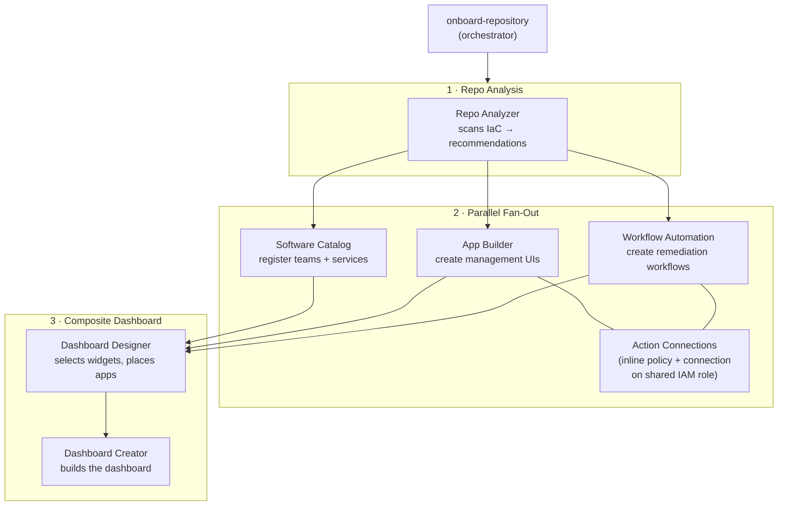

# Architecture Overview

This project uses Claude Code skills to automate Datadog onboarding for infrastructure repositories.

---

## Phase 1: Prerequisites

Before onboarding, the following must be in place:

- **Anthropic API Key / Claude Authentication** — valid Anthropic API key configured for Claude Code
- **AWS ↔ Datadog Integration** — bidirectional trust between your AWS account and Datadog
- **API Key + APP Key** — generated in your Datadog organization
- **Workflow Actions registration** — APP Key must be registered with the Workflow Automation Actions API
- **Cloud provider resource tagging** - Cloud provider resources must be tagged at minimum `service` tags and ideally `team` tags.
- **Docker** — required for the Terraform MCP server (runs as `docker run hashicorp/terraform-mcp-server`); Docker Desktop must be running when using Terraform output format

---

## Phase 2: Onboarding Your Project

The `onboard-repository` skill orchestrates everything in three stages.

**Input** — a repo path containing IaC files (CloudFormation, Terraform, etc.)



1. **Repo Analysis** — scans IaC files, identifies services, and produces a tiered recommendation plan
   - Identifies type of IaC tooling used (Terraform, CloudFormation, etc.) This determines the output format of the subsequent skills. For Terraform projects the skills will generate Terraform resources for Datadog, for CloudFormation projects the skills will generate shell commands to create the resources.
   - *Output*: recommendations report (services identified, app/workflow candidates, tiered plan)
2. **Parallel fan-out** — three skills run concurrently:
   - **Software Catalog** — registers teams and services in Datadog
   - **App Builder** — creates management UIs, each with its own Action Connection on the shared project IAM role
   - **Workflow Automation** — creates remediation workflows, each with its own Action Connection on the shared project IAM role
   - *Output*: registered catalog entities + deployed apps + active workflows (resource UUIDs collected)
3. **Composite Dashboard** — two-step process:
   - **3a: Dashboard Designer** — selects relevant widgets from example dashboards, places apps and workflows in operationally relevant groups
   - **3b: Dashboard Creator** — builds the dashboard from the design spec
   - *Output*: a single composite dashboard URL linking everything together

### Example Prompts

These prompts use example projects in the `.claude/test-projects/` directory. You could also point them at other project directories you have locally. In the current state of the code, the orchestrator will save all artifacts to this `hackathon-team-3` project as it works to onboard the project.

To preview what would be created without making any API calls (dry-run mode):

```
dry-run onboard this project to datadog please @.claude/test-projects/stickerlandia/
```

To run the full onboarding and create all Datadog resources:

```
onboard this project to datadog please @.claude/test-projects/stickerlandia/
```

When complete, you'll have: Software Catalog entries for each service, App Builder UIs for managing AWS resources, automated remediation workflows, and a composite dashboard that ties it all together.

[Example dashboard output](https://app.datadoghq.com/dashboard/4yc-4qx-8jw/)


---

## Dev/Test Isolation with REPO_ID

Every onboarding run is assigned a **REPO_ID** — a 4-character alphanumeric suffix (e.g., `A3F7`) generated at the start of Phase 0. The REPO_ID is appended to all Datadog and IAM resource names created by the run:

| Resource | Example name with REPO_ID |
|---|---|
| IAM shared role | `datadog-stickerlandia-shared-role-A3F7` |
| Action connection | `stickerlandia-ecs-tasks-conn-A3F7` |
| IAM inline policy | `app-ecs-mgmt-policy-A3F7` |
| App Builder app | `ECS Task Manager [A3F7]` |
| Workflow | `ECS Rollback [A3F7]` |
| Dashboard | `Stickerlandia Operations [A3F7]` |
| Run directory | `stickerlandia-20260226-143052-A3F7/` |

**Exceptions:** Software Catalog team and service names are never suffixed — they represent real entities shared across runs. If a team or service already exists in Datadog, the skill skips registration rather than overwriting it.

The REPO_ID is printed prominently at the end of the run and stored in `run-metadata.json` and `onboarding-uuids.json`. In shell mode, `manifest.json` records the delete command for every suffixed resource, enabling cleanup of a specific run without affecting others.

To supply a specific REPO_ID (e.g., for a known test run):
```bash
REPO_ID=TEST onboard /path/to/repo for Datadog
```

---

## Artifact Storage

Every onboarding run writes its output to `dd-onboarding-output/` at the repo root. Each run gets a unique subdirectory named `{project}-{YYYYMMDD-HHMMSS}-{repo_id}` so runs never collide.

| Output Format | What gets stored |
|---|---|
| **Terraform** | A self-contained root module (`terraform/` subdir) with `providers.tf`, `variables.tf`, and one `.tf` file per resource. The orchestrator runs `terraform apply` at the end. |
| **Shell** | Resources are created via API calls. A `manifest.json` records every resource with its ID and the exact command to delete it, enabling automated cleanup. |

Both modes produce `run-metadata.json` (run status, phase tracking, and `repo_id`) and `onboarding-uuids.json` (resource IDs passed between phases).

```
dd-onboarding-output/
└── stickerlandia-20260226-143052-A3F7/
    ├── run-metadata.json        ← includes "repo_id": "A3F7"
    ├── repo-analysis.json
    ├── datadog-recommendations.md
    ├── onboarding-uuids.json    ← includes "repo_id": "A3F7"
    ├── terraform/          ← Terraform mode
    │   ├── providers.tf
    │   ├── variables.tf
    │   ├── outputs.tf
    │   ├── shared_role.tf
    │   ├── conn_app_*.tf
    │   ├── app_*.tf
    │   ├── wf_*.tf
    │   ├── catalog.tf
    │   └── dashboard_*.tf
    └── manifest.json       ← Shell mode
```

### Skill Structure

```
skill-name/
├── SKILL.md              # Playbook + gotchas + doc fetch URLs
└── examples/             # JSON specs (where applicable)
    └── *.json
```

## Skills Inventory

| Skill | What it does |  
|---|---|
| `repo-analyzer` | Scans IaC files and produces tiered Datadog resource recommendations |
| `app-builder` | Creates and deploys App Builder management UIs for AWS services |
| `workflow-automation` | Creates automated remediation workflows |
| `action-connections` | Provisions IAM policies + Datadog Action Connections on a shared project-level IAM role |
| `software-catalog` | Registers teams and services in the Datadog Software Catalog |
| `dashboard-designer` | Reasons about which widgets, apps, and workflows belong on the dashboard |
| `dashboard-creator` | Builds composite dashboards with embedded apps and workflows |
| `onboard-repository` | End-to-end orchestrator — runs all skills in dependency order |
| `onboard-repository-dry-run` | Preview mode — generates a report of what would be created |
| `action-catalog-extractor` | Extracts workflow action definitions from dd-source |

### Output Formats

| `preferred_output_format` | What happens |
|---|---|
| `terraform` | Claude queries Terraform MCP server for provider docs + generates `.tf` modules |
| `shell` | Claude executes `curl` + `aws cli` commands directly via Bash |

### MCP Servers (`.mcp.json`)

| Server | Transport | Purpose |
|---|---|---|
| `datadog-mcp` | HTTP (`https://mcp.datadoghq.com/api/unstable/mcp-server/mcp`) | Datadog API tools and resource management |
| `playwright` | stdio (`npx @playwright/mcp@latest`) | Browser automation for UI testing |
| `terraform` | stdio (`docker run hashicorp/terraform-mcp-server`) | Terraform registry docs — **requires Docker running** |

### External Doc Sources

- **Datadog docs** via `.md` URLs — fetched at runtime by Claude (API refs, product pages)
- **Terraform MCP server** — provides Datadog provider resource docs via `.mcp.json` (requires Docker)


## Test Projects

| Directory | Contents |
|---|---|
| `.claude/test-projects/stickerlandia/` | Microservices CloudFormation templates (8 stacks) |
| `.claude/test-projects/simple-cloudformation-test-app/` | Simple single-stack CloudFormation template |
| `.claude/test-projects/tf-simple/` | Simple Terraform configuration with Lambda |
| `.claude/test-projects/techstories/` | Multi-module Terraform project (VPC, RDS, EC2, ECS, Lambda/DynamoDB, Step Functions/SQS) |

## Dev Notes

**`OTEL_TRACES_EXPORTER`:** If this env var is set in your shell (common when Datadog Agent is running locally), Terraform will try to export traces to it and may hang or fail. All Terraform commands in the skill playbooks prepend `unset OTEL_TRACES_EXPORTER &&` to avoid this.

## Tech Stack

| Component | Role |
|---|---|
| Terraform | IaC for Datadog resources and AWS infrastructure |
| CloudFormation | AWS-native IaC templates |
| Datadog App Builder | Interactive AWS management UIs |
| Datadog Workflow Automation | Automated remediation pipelines |
| Datadog Dashboards | Observability + embedded app widgets |
| Datadog Software Catalog | Service registry + dependency mapping |
| Datadog Action Connections | Secure AWS credential bridging (assume-role) |
| Terraform MCP Server | Runtime provider docs for Claude |
| Claude Code | AI-assisted development + execution |
