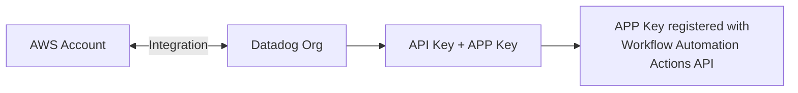
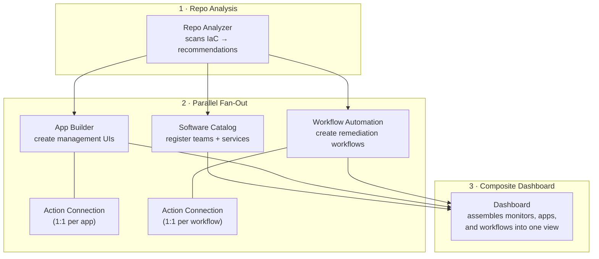
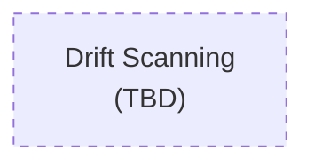

# Architecture Overview

This project uses Claude Code skills and agents to automate Datadog onboarding for infrastructure repositories. The process is organized into three phases.

---

## Phase 1: Prerequisites

Before onboarding, the following must be in place:

- **AWS ↔ Datadog Integration** — bidirectional trust between your AWS account and Datadog
- **API Key + APP Key** — generated in your Datadog organization
- **Workflow Actions registration** — APP Key must be registered with the Workflow Automation Actions API

---

## Phase 2: Onboarding Your Project

The `onboard-repository` skill orchestrates everything in three stages:

1. **Repo Analysis** — scans IaC files, identifies services, and produces a tiered recommendation plan
2. **Parallel fan-out** — three skills run concurrently:
   - **Software Catalog** — registers teams and services in Datadog
   - **App Builder** — creates management UIs, each with its own dedicated Action Connection
   - **Workflow Automation** — creates remediation workflows, each with its own dedicated Action Connection
3. **Composite Dashboard** — pulls everything together into a single operational dashboard

---

## Phase 3: Ongoing / Maintenance

> _This phase is planned but not yet implemented._

- **Drift scanning** — detect when deployed resources diverge from IaC definitions
- Additional maintenance workflows to be defined
