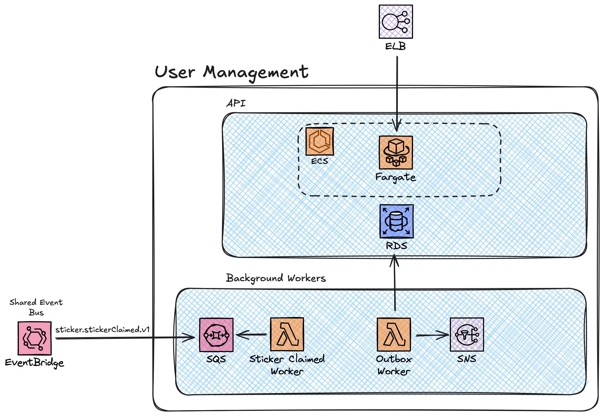

# Stickerlandia User Management Service

The **Stickerlandia User Management Service** is a comprehensive, cloud-native user authentication and management system built with .NET 8. It serves as a complete OAuth 2.0 authorization server and user management platform, designed with **platform adaptability** as a core principle to run seamlessly on Azure, AWS, or any cloud-agnostic container orchestrator.

## What This Application Does

The User Management Service provides a complete identity and access management solution for the Stickerlandia ecosystem:

### 🔐 **OAuth 2.0 Authorization Server**
- Full OAuth 2.0 authorization server implementation using [OpenIddict](https://documentation.openiddict.com/)
- Authorization Code Flow with PKCE support for frontend applications (SPAs, mobile apps)
- Refresh token support for seamless user experience
- Secure user authentication and authorization
- Standard OAuth 2.0 endpoints: `/connect/authorize`, `/connect/token`, `/connect/logout`, `/connect/userinfo`

### 👥 **User Account Management**
- User registration and profile management
- ASP.NET Core Identity integration with custom user models
- Account tiers and types support
- Sticker tracking and gamification features
- Self-service account updates

### 🚀 **Event-Driven Architecture**
- Publishes user lifecycle events (registration, profile updates)
- Processes external events (sticker claiming)
- Implements outbox pattern for reliable event delivery
- Platform-specific messaging: SNS/SQS (AWS), Service Bus (Azure), Kafka (Agnostic)

### 🌐 **Multi-Platform Support**
- **Azure Native**: Azure Functions, Service Bus, PostgreSQL
- **AWS Native**: Lambda functions, SNS/SQS, PostgreSQL  
- **Cloud Agnostic**: Kafka, PostgreSQL, containerized workers

### 📊 **Production-Ready Features**
- Comprehensive health monitoring and observability
- Structured logging and error handling (RFC 7807 Problem Details)
- Static code analysis and quality enforcement
- Full test coverage with platform-specific integration tests
- Infrastructure as Code for AWS (CDK) and Azure (Terraform)

The service provides one primary API:

- **User Management API** (`/api/users/v1`) - RESTful API for user operations and OAuth 2.0 endpoints

## Architecture

### Separation of Concerns

The project follows a ports and adapters architecture style, split down into `Driving` and `Driven` adapters, as well as a `Core` library.

- **Stickerlandia.UserManagement.Agnostic** - Driven adapters for Agnostic services
- **Stickerlandia.UserManagement.AWS** - Driven adapters for AWS native services
- **Stickerlandia.UserManagement.Azure** - Driven adapters for Azure native services

- **Stickerlandia.UserManagement.Api** - Driving adapters for a containerized ASP.NET minimal API
- **Stickerlandia.UserManagement.Worker** - A seperate background worker service for agnostic background workers
- **Stickerlandia.UserManagement.Migration Service** - An independent background worker for running database migrations and seeding initial user data
- **Stickerlandia.UserManagement.FunctionApp** - Driving adapters for a Azure function app background workers
- **Stickerlandia.UserManagement.Lambda** - Driving adapters for AWS Lambda background workers

- **Stickerlandia.UserManagement.Core** - Core library for domain services
- **Stickerlandia.UserManagement.Auth** - Core library for auth concerns using [OpenIddict](https://documentation.openiddict.com/)


### AWS Architecture



The AWS native implementation of the user management service uses a combination of containers and functions as a service (FaaS), as well as native messaging services. The different components on this diagram tie to specific classes in the AWS CDK IaC project:

- [API](./infra/aws/lib/api.ts)
    - Amazon ECS for container orchestration, with Fargate providing the underlying compute
    - A traditional Postgres database, for use with the [OpenIddict](https://documentation.openiddict.com/) auth libraries
- [Background Workers](./infra/aws/lib/background-workers.ts)
    - AWS Lambda for the compute, both handling external events and running on a schedule to process items from the outbox
    - Rules are defined on a shared external Amazon Event Bridge event bus
    - Amazon SQS provides durability at the boundaries of the system
    - Internal domian events are published to Amazon SNS
- [Shared](./infra/aws/lib/sharedResources.ts)
    - Currently, these are manually created. Eventually these will be created in an external stack and this construct will pull from 

## API Endpoints

### User Management API (`/api/users/v1`)

You can find the full [Open API specification in the docs folder](./docs/api.yaml).

## Key Features

### Authentication & Authorization
- **OAuth 2.0 Authorization Server** - Complete implementation with OpenIddict
- **Authorization Code Flow with PKCE** - Secure authentication for SPAs and mobile apps
- **Refresh Token Support** - Seamless token refresh for better UX
- **Multiple Scopes** - Support for `email`, `profile`, and `roles` scopes
- **ASP.NET Core Identity Integration** - Robust user management with custom models

### User Management
- **User Registration** - Self-service account creation with validation
- **Profile Management** - Update user details, preferences, and settings  
- **Account Tiers & Types** - Support for different user account levels
- **Sticker Gamification** - Track and manage user sticker collections
- **Security** - JWT-based API authentication with proper access controls

### Platform Adaptability
- **Multi-Cloud Support** - Deploy on Azure, AWS, or cloud-agnostic platforms
- **Flexible Architecture** - Ports and adapters pattern for clean separation
- **Event-Driven Design** - Reliable event publishing with outbox pattern
- **Background Processing** - Platform-specific workers (Functions, Lambda, containers)

### Developer Experience
- **.NET Aspire Integration** - Local development with different platform profiles
- **Comprehensive Testing** - Unit and integration tests for all platforms
- **API Documentation** - OpenAPI and AsyncAPI specifications
- **Infrastructure as Code** - AWS CDK and Azure Terraform templates

## Events

You can find the full [Async API specification for events published and received in the docs folder](./docs/async_api.yaml)

## Authentication

The service implements a complete OAuth 2.0 authorization server using [OpenIddict](https://documentation.openiddict.com/). For detailed authentication flows and integration guidance, see [Authentication Documentation](./docs/Auth.md).

### Quick Overview
- **Endpoints**: Authorization (`/connect/authorize`), Token (`/connect/token`), Logout (`/connect/logout`), UserInfo (`/connect/userinfo`)
- **Supported Flows**: Authorization Code with PKCE, Refresh Token
- **Scopes**: `email`, `profile`, `roles`
- **API Authentication**: JWT Bearer tokens required for all endpoints except `/health` and `/register`
- **Access Control**: Users can only operate on their own accounts unless they have admin privileges

### Default User

If you run the **Stickerlandia.UserManagement.Migration Service** the database migrations are applied and two default users are created:

- User
    - Email address: user@stickerlandia.com
    - Password: Stickerlandia2025!
- Admin User
    - Email address: admin@stickerlandia.com
    - Password: Admin2025!

### For Client Applications
To integrate with this OAuth 2.0 server, client applications should implement the Authorization Code Flow with PKCE. See the [Auth.md documentation](./docs/Auth.md) for sequence diagrams.

## Error Handling

The API returns standard HTTP status codes and follows the RFC 7807 Problem Details specification for error responses.

## Configuration

The service is configured via environment variables and connection strings:

### Platform Configuration
- `DRIVEN` - Driven adapter platform: `AZURE`, `AWS`, `AGNOSTIC`, or `GCP` (required)
- `DRIVING` - Driving adapter platform: `AGNOSTIC`, `AZURE`, `AWS`, `GCP`, `AZURE_FUNCTIONS`, or `AWS_LAMBDA` (default: `AGNOSTIC`)

### Server Configuration
- `DEPLOYMENT_HOST_URL` - Public base URL for the service, used for OAuth redirects (default: `http://localhost:8080`)

### Database Configuration
- `ConnectionStrings__database` - PostgreSQL connection string (required)

### Authentication Configuration
- `DISABLE_SSL` - Disable SSL requirement for development (default: `false`)
- `OPENIDDICT_ISSUER` - Explicitly set the OpenIddict issuer URI (optional)

### Messaging Configuration
- `ConnectionStrings__messaging` - Messaging infrastructure connection string (required)
  - For Kafka: Bootstrap servers connection string
  - For Azure Service Bus: Service Bus connection string
  - For GCP Pub/Sub: GCP Project ID

### Kafka Configuration (when DRIVEN=AGNOSTIC)
- `KAFKA_USERNAME` - SASL username for Kafka authentication (optional)
- `KAFKA_PASSWORD` - SASL password for Kafka authentication (optional)

### AWS Configuration (when DRIVEN=AWS)
- `ENV` - Environment name for EventBridge event source (default: `dev`)
- `Aws__EventBusName` - AWS EventBridge event bus name (required)
- `Aws__UserRegisteredTopicArn` - SNS topic ARN for user registered events (required)
- `Aws__StickerClaimedQueueUrl` - SQS queue URL for sticker claimed messages (required)
- `Aws__StickerClaimedDLQUrl` - SQS dead letter queue URL for failed messages (required)
- AWS credentials via standard AWS SDK chain (environment variables, IAM role, etc.)

### GCP Configuration (when DRIVEN=GCP)
- `PUBSUB_PROJECT_ID` - GCP Pub/Sub project identifier (required)
- `PUBSUB_EMULATOR_HOST` - GCP Pub/Sub emulator endpoint for local development (default: `[::1]:8432`)

### Logging Configuration
Standard .NET logging configuration via `Logging:LogLevel` in appsettings.json:
- `Default` - Default log level (default: `Information`)
- `Microsoft.AspNetCore` - ASP.NET Core log level (default: `Warning`)

## Building and Running

### Prerequisites
- .NET 8.0
- .NET Aspire

### Development

One of the core principles of Stickerlandia is **platform adaptability** by design. That means the user service can run on Azure, AWS or any cloud agnostic container orchestrator. When developing locally, you can use [.NET Aspire](https://learn.microsoft.com/en-us/dotnet/aspire/get-started/aspire-overview) to run and debug the application locally whichever stack you want to deploy against. The .NET Aspire project has different launch profiles for each of the different hosting models.

Run with Agnostic services *(Kafka, Postgres)*:
```bash
cd src/Stickerlandia.UserManagement.Aspire
dotnet run -lp agnostic
```

Run with Azure services *(Azure Functions, Azure Service Bus, Postgres)*:
```bash
cd src/Stickerlandia.UserManagement.Aspire
dotnet run -lp azure_native
```

Run with AWS services *(AWS Lambda, Amazon SNS, Aamzon SQS, Postgres)*:
```bash
cd src/Stickerlandia.UserManagement.Aspire
dotnet run -lp aws_native
```

### Testing

Run unit tests:
```bash
cd tests/Stickerlandia.UserManagement.UnitTest
dotnet test
```

The integration tests use [.NET Aspire testing support](https://learn.microsoft.com/en-us/dotnet/aspire/testing/write-your-first-test?pivots=xunit). This enables you to run full integration tests for each of the individual hosting models. To run the tests, you need to set the `DRIVING` and `DRIVEN` environment variables.

Run Agnostic integration tests:
```bash
cd tests/Stickerlandia.UserManagement.IntegrationTest
export DRIVING=AGNOSTIC
export DRIVEN=AGNOSTIC
dotnet test
```

Run Azure integration tests:
```bash
cd tests/Stickerlandia.UserManagement.IntegrationTest
export DRIVING=AZURE
export DRIVEN=AZURE
dotnet test
```

Run AWS integration tests:
```bash
cd tests/Stickerlandia.UserManagement.IntegrationTest
export DRIVING=AWS
export DRIVEN=AWS
dotnet test
```

## Code Quality

This project enforces high code quality through the use of static analysis tools:

.NET has built-in Roslyn analyzers that inspect your C# code for code style and quality issues. To enforce these styles, a [`Directory.build.props`](./Directory.build.props) file is included in the repository root that turns on all static analysis tools.
